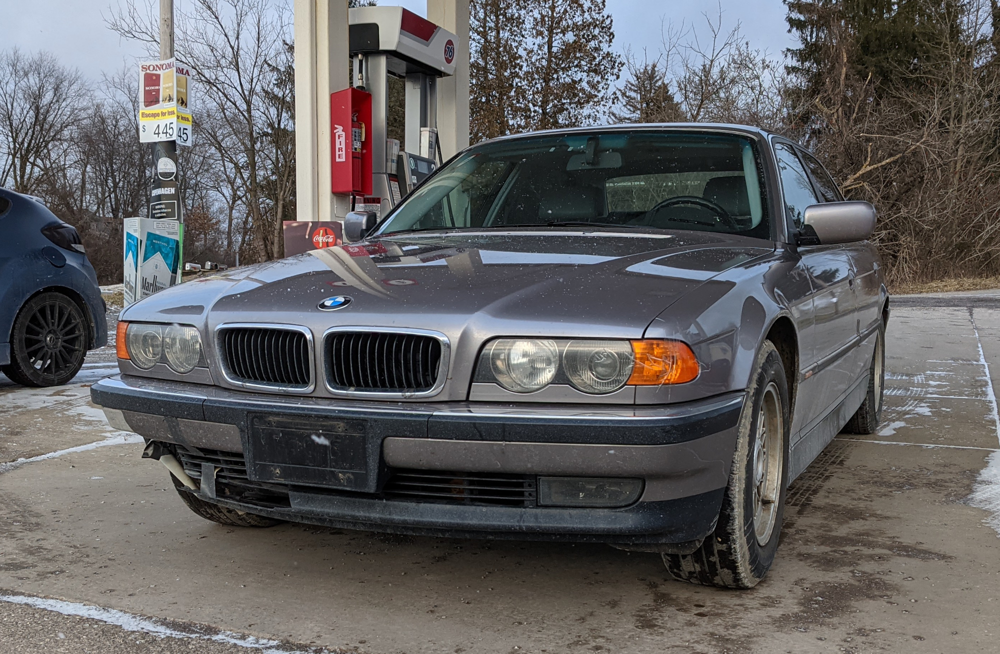
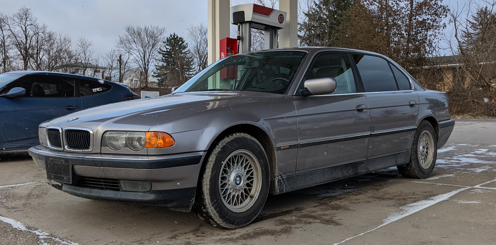
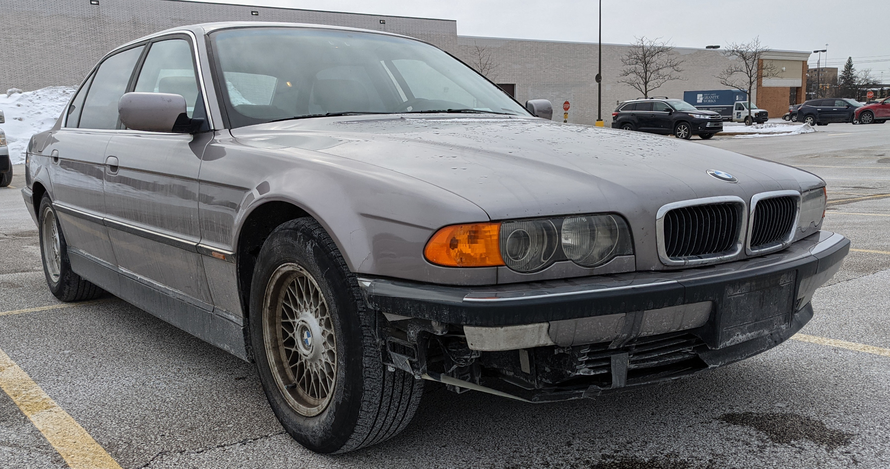

## Why Did I Buy It?

I have been driving my Honda Civic for a few years now, but never ended up feeling attached to it since buying my E46 330Ci a couple years ago. Since getting a taste of the BMW experience, I have also been wanting of a more luxurious car that offers great dynamics, ergonomics, and comfort (NVH is a huge letdown in the Civic). Or it could be me just getting old.

During my online searches, I came across a very reasonably priced 1999 740iL very close to me that I absolutely had to check out. Upon talking to the owner and doing a cursory inspection to the best of my abilities, the little gremlin in my mind was already telling me to buy it. So, I bought it the following week and I do not regret it at all.

## The E38

## Current Issues

Naturally, any neglected or even slightly neglected BMW will present itself with problems. As the images indicate, the main visual flaw is the damaged front bumper, fog lights, and ambient temperature sensor. Inside the car, the instrument cluster indicates the infamous "trifecta" that points to a faulty ABS module. The interior headliner is also drooping in several areas and the HID lowbeams are throwing an error. However, all the major items (eg radio display, MID, almost all speakers, cup holders, 12V power outlet).

## Project Plans for 2021

I intend to address all main issues warranted of a BMW of this vintage starting early spring of 2021. The goal is to proof the E38 so that it can supplant my Honda as my daily driver. To make this possible, the following is the current plan of action for the car in no particular order:

- full cooling system refresh (yes I know absolutely mandatory for these BMWs :stuck_out_tongue_winking_eye:)
- full suspension refresh
    - control arms and all bushings
- all fluids replace
- radio/head unit replacement with new amp and speakers
- interior deep clean
- headliner replacement
- send ABS module for rebuilding 
- replace front bumper and bumper liner
- replace fog lights and lowbeam headlights
- polish headlights and apply coating
- retrofit a new 12V cigarette outlet with voltmeter + 12V
- lube window regulators
- new wheels for summer
- re-affix window trim and door trim and replenish any rubber seals
- replace missing jack pads 2x

This car is very much a learning experience for me and I will be documenting the process in this blog series. In the meantime, we wait for the temperatures to rise! :snowflake: :snowflake: :snowflake:

