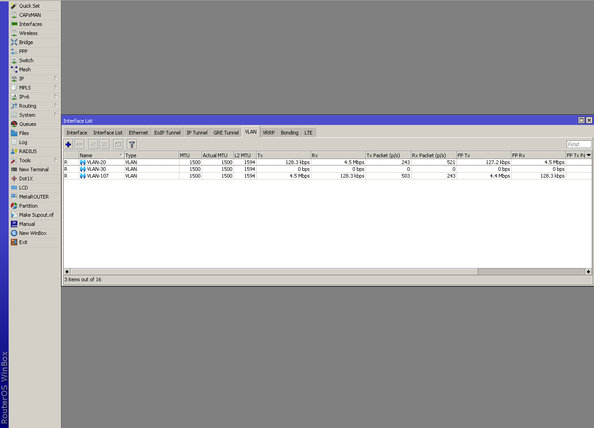
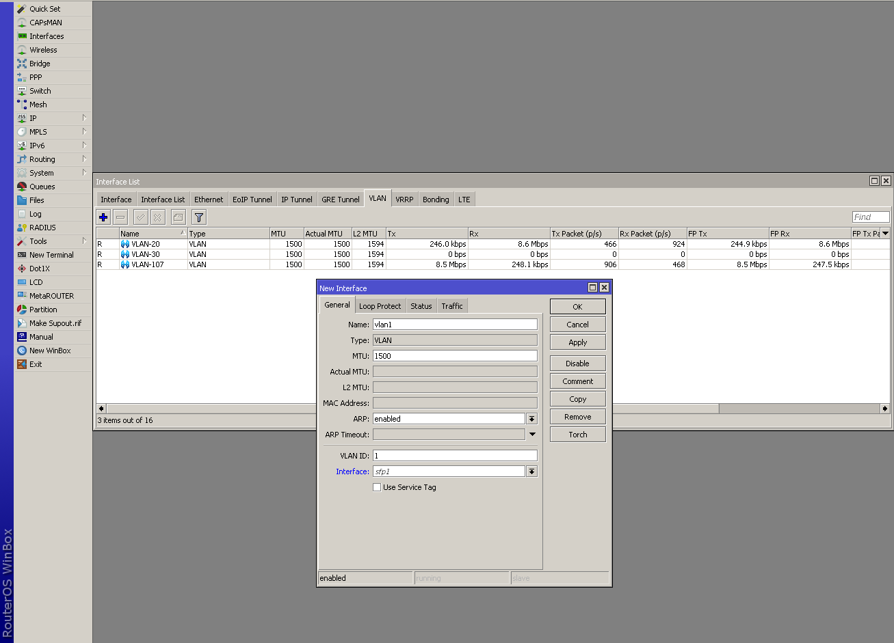
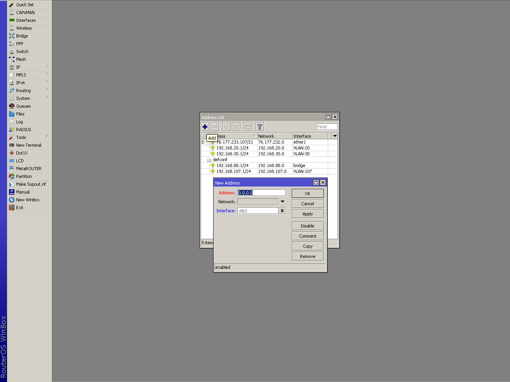
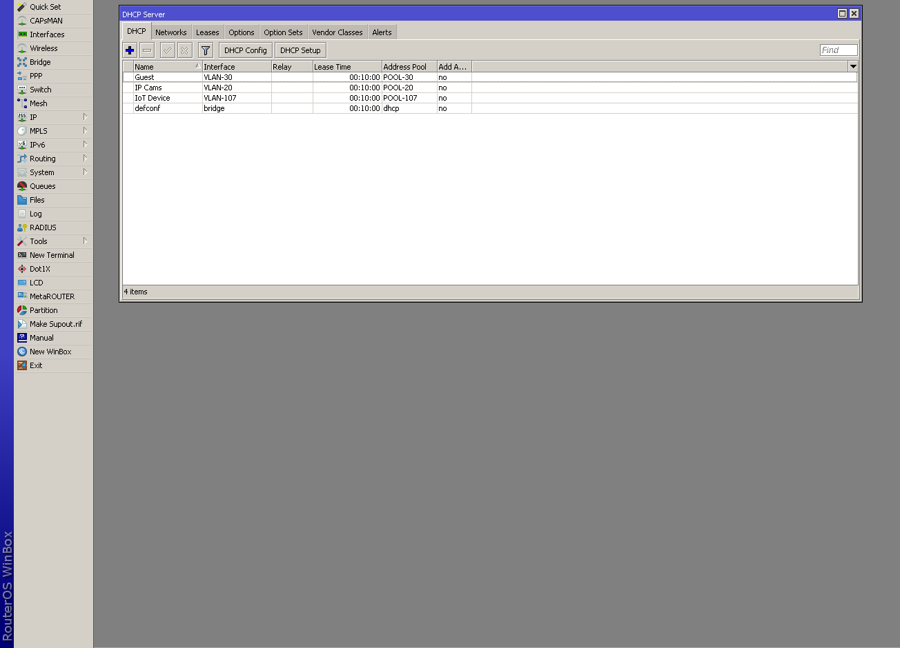
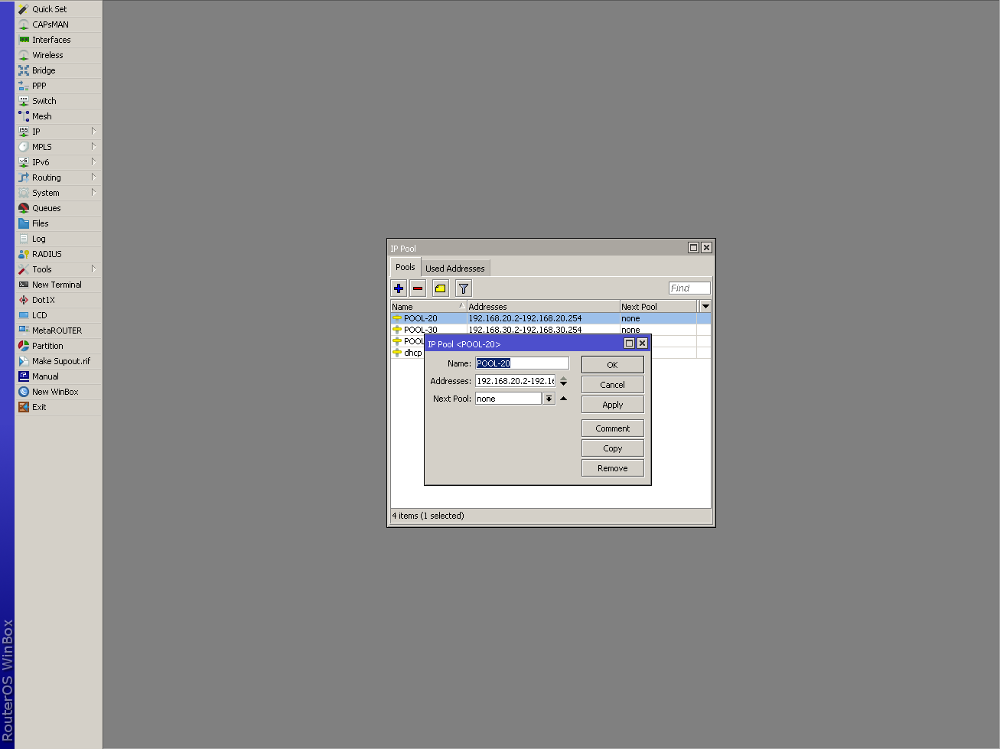
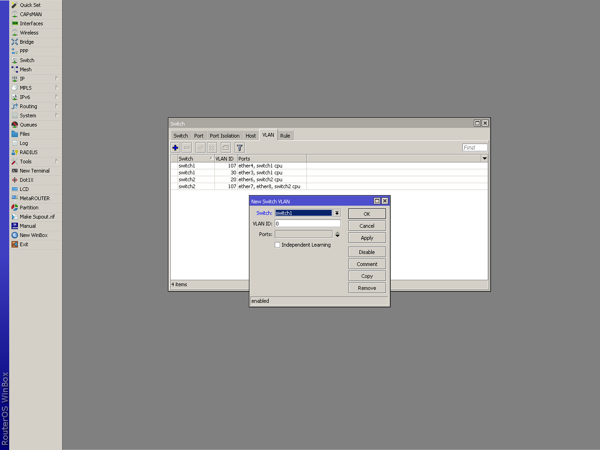
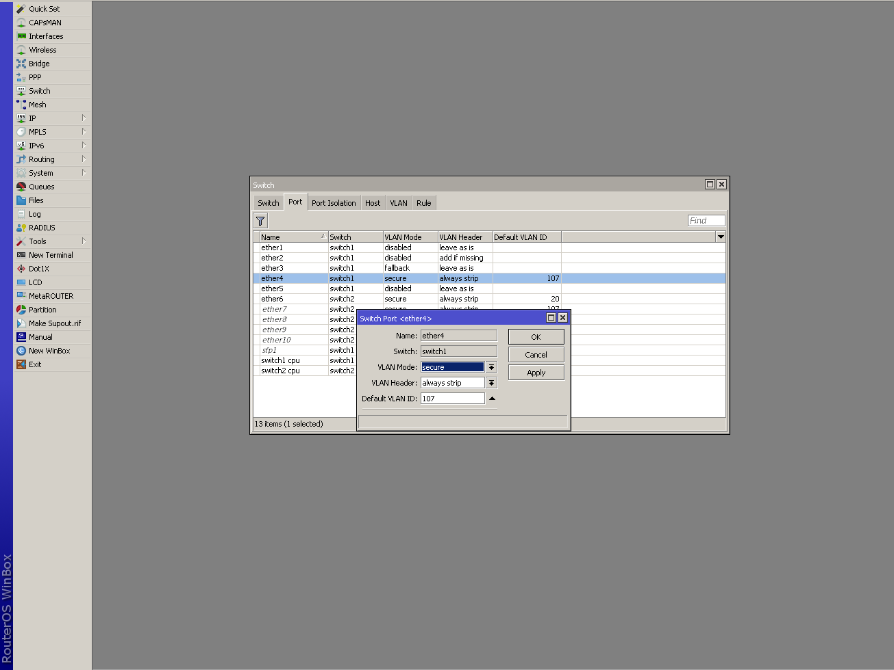
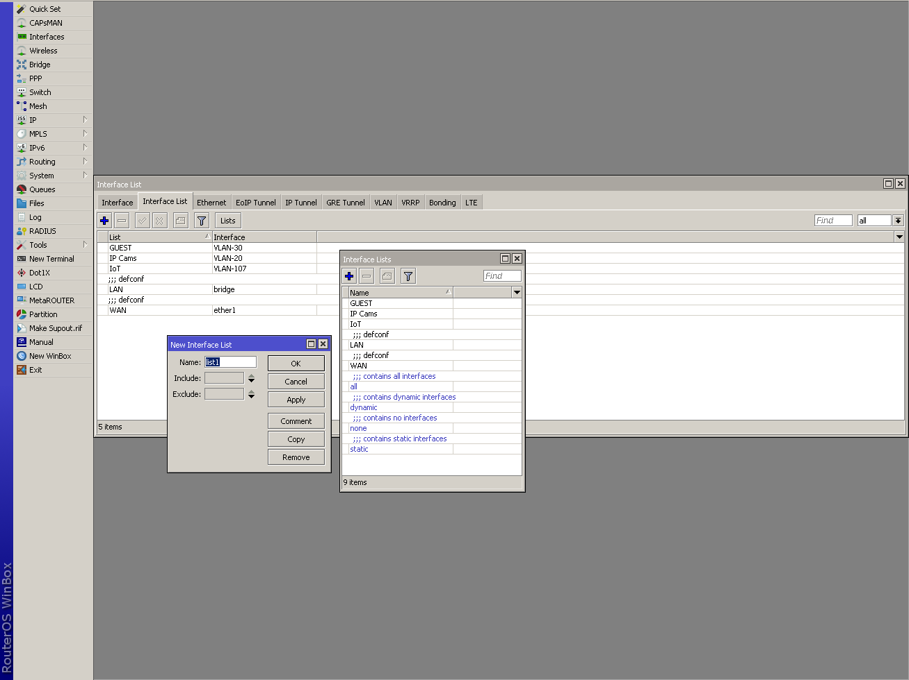
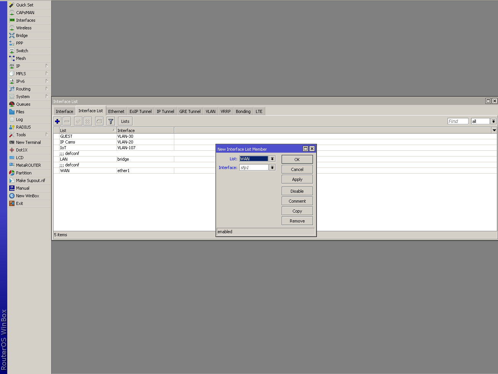
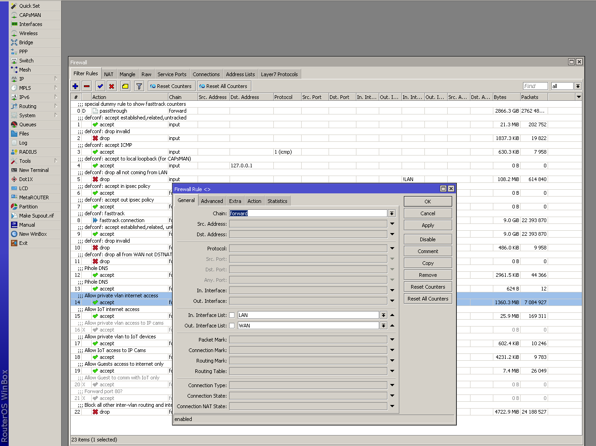

## Motivation

To increase the security of my property, I decided to install IP surveillence cameras in high traffic areas. However, being the OCD and cheapskate I am, I wanted to retain full control while maintaining a reasonable budget. This meant deploying cheap Chinese brand cameras that will undoubtedly be phoning home - which has to be addressed on the network through virtual local area networks (VLANS). By implementing VLANs, I not only have an excuse to upgrade to newer networking hardware, but also will be greatly increasing my overall home network security.

Formerly running a basic Netgear router, the first step was to find a suitable replacement. My internet searches led to me a few options: diy Pfsense router, Mikrotik, or Ubiquity EdgeRouter. After careful consideration, I ultimately decided on purchasing a Mikrotik RB2011 series router. As with any choice, the compromise here is that Mikrotik's settings configuration is not as intuitive as Ubiquity's, but is offset by the cheaper price to performance + features. 

Because Mikrotik routers might be confusing for beginners first using them, this post will attempt to provide a guide for how to setup VLANs, perhaps the most essential feature of any modern home nework, big or small. 

## VLANs As Understood by a Monkey

A VLAN is a virtual LAN that essentially acts as a subnet on a single network. 
As the name suggests, it creates a virtual LAN to make it appear that there exist multiple networks on a single network. To provide sufficient background, I will define some terms needed for understanding:

* VLAN - is a logical grouping, or division of network traffic at the data link layer (layer 2) that divides by broadcast domain
* router - is a device that connects two or more networks and trasfers data among them
* switch - is a device on a network that connects other devices on the same network
* broadcast domain - is broadcasting, the act of sending a signal to all devices on a particular network segment. Every VLAN has its own broadcast domain.

Each VLAN is defined by a VLAN ID that is appended to the packets exiting devices on a defined VLAN port on a switch. This ID is used by the VLAN table on the router and switch(es) to keep network traffic segregated. In order to allow traffic between certain VLANs, firewall rules have to be defined to allow inter-VLAN routing.

## Setting up a Virgin Mikrotik Router

The process assumes one is starting from a bone stock router with default factory settings. This process is for the RB2011 series router that contains a seperate switch chip, which requires a slightly different configuration compared to using bridges to create VLANs.

To start, login to the router via the [Winbox](https://mikrotik.com/download) utility. For the initial login, select the MAC address as the router ID. The default user is "admin" and the password is empty. Make sure to update the password.

### Create New VLANs

First, create the new VLAN interface by selecting the "Interfaces" button in the column menu on the left. With the Interface List window open, select the "VLAN" tab -> + icon and create the new VLAN. The important fields to fill out are:

* Name - the name of the VLAN
* VLAN ID - this is the integer identifier used for tagging traffic that belongs to this VLAN. 1 is the default so you want to change it to something like 10, 20, 30, etc. 
* Interface - is source interface the VLAN comes from. In this case, we will be using all the ports on the LAN, which correponds to the default "bridge" interface in the dropdown menu.

 Interface Menu
 Add new VLAN

### Add IP Addresses for VLANs

Next, we need create an address range for the newly created VLAN. Select "IP" -> "Addresses" from the column menu. Click the + to add a new address. The two selections to fill out are:

* Address - the address range. You can choose whatever you would like. An example range would be 192.168.60.1/24, which signifies the range of addresses from 192.168.60.1-255. 
* Interface - will be the VLAN interface we created earlier.

### Create DHCP Servers for VLANs

Next, select from the menu "IP" -> "DHCP Server" and the "DHCP" tab. Here, the virtual DHCP server for the VLAN is created by going through the handy wizard by clicking the "DHCP Setup." Follow the wizard and ensure the interface is the VLAN interface and the correct IP address range. 

#### Change name of Address Pool (Optional)

The DHCP server wizard automatically creates the Address Pool and sets a default name. If so inclined, the name can be changed by selecting "IP" -> "Pool" from the column menu.

If using a custom DNS server for the VLAN, it can be changed by selecting the "Networks" tab in the DHCP Server window. Double click the address range that corresponds to the VLAN and input in the custom DNS server IP.

### Configure Switch Chip

Next, we need to actually tell the router which of its physical ports belong to a particular VLAN. Because the RB2011 and 3011 series routers have hardware switch chips that handle this, it is best to take advantage of them and configure hardware VLANs via the switch chips.

In the column menu, select "Switch" -> "VLAN" to assign VLAN ID(s) to a port. 

Click the + to add assign port(s) to a VLAN. In this case, the RB2011 has two switch chips. Switch1 controls eth1-5 and switch2 controls eth6-10. In the image above, I have added some rules already. Let's break down the first rule. On switch1, there's VLAN ID of 107 on ports ether4, switch1 cpu. This effectively tells the switch chip that port ether4 that it belongs on the VLAN 107 network. Note, it is important to select switch1 cpu for this to work. 

Next, select the Port tab for additional configuration.

Let us continue with the example of adding VLAN 107 to ether4. Double click the ether4 row to edit its settings. In this case, I want all traffic from port 4 to be exclusively part of VLAN 107, so VLAN Mode has to be set to secure. VLAN Header has to be "always strip" becasue this is an access port and thus the VLAN tag must be removed on egress traffic. Lastly, because this is an acess port, the Default VLAN ID must be defined, which in this case is 107.

Before moving on, we must configure switch1_cpu as well. In my case, I have tagged and untagged traffic that is handled by switch1's ports, so set VLAN Mode to fallback. VLAN Header must be "leave as is" because we have hybrid ports and default VLAN ID is 1. For further information on switch chip features, see the official Mikrotik Wiki: https://wiki.mikrotik.com/wiki/Manual:Switch_Chip_Features.

### Firewall Rules

Lastly, and most importantly we must define the firewall rules to ensure VLAN network security. But before this, I like to define interface lists for the VLANs to make it easier and safer when defining firewall rules. 

#### Interface Lists

To create an interface list, select Interface -> Interface List from the column menu. Then click the "Lists" button to open up the "Interface Lists" window. Press the + to create a new interface list and simply give it a name and press ok. 

This newly created list will appear in the Interface Lists window's list. As can be seen, I have GUEST, IP Cams, and IoT in addition to the defconf lists. Exit the interface lists window and in the interface list tab, press the + to add a new interface list member. Choose the list name and select the VLAN interface for which it belongs to. Presto done.

#### Essential Firewall Rules

Now select IP -> Firewall to add the additional firewall rules to take advantage of VLANs and enable intervlan routing. The first rule I like to add is to allow the LAN access to the internet. You may wonder why when there is already internet access. This is to preempt the next rule which is a blanket blocking of all undefined connections. 

Click the blue + to add the new rule. In the Firewall Rule window -> General, ensure Chain is foward. In Interface List is LAN and Out Interface List is WAN. Under the action tab, ensure accept is selected. To allow intervlan routing between the LAN and the VLAN, you will use the same exact setting, but replace the Out Interface List with the name of the VLAN interface list create above. 

The last and most important rule is to block all other traffic.

Add a new rule via the blue + with the following settings:
* General -> chain: forward
* Action -> drop

Comment these rules to your desire for readability. That is all, you have implemented VLANs on a Mikrotik router!

## References

1. https://www.computernetworkingnotes.com/ccna-study-guide/vlan-basic-concepts-explained-with-examples.html
1. https://wiki.mikrotik.com/wiki/Manual:Switch_Chip_Features
