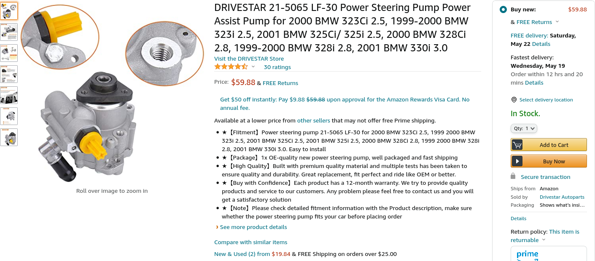
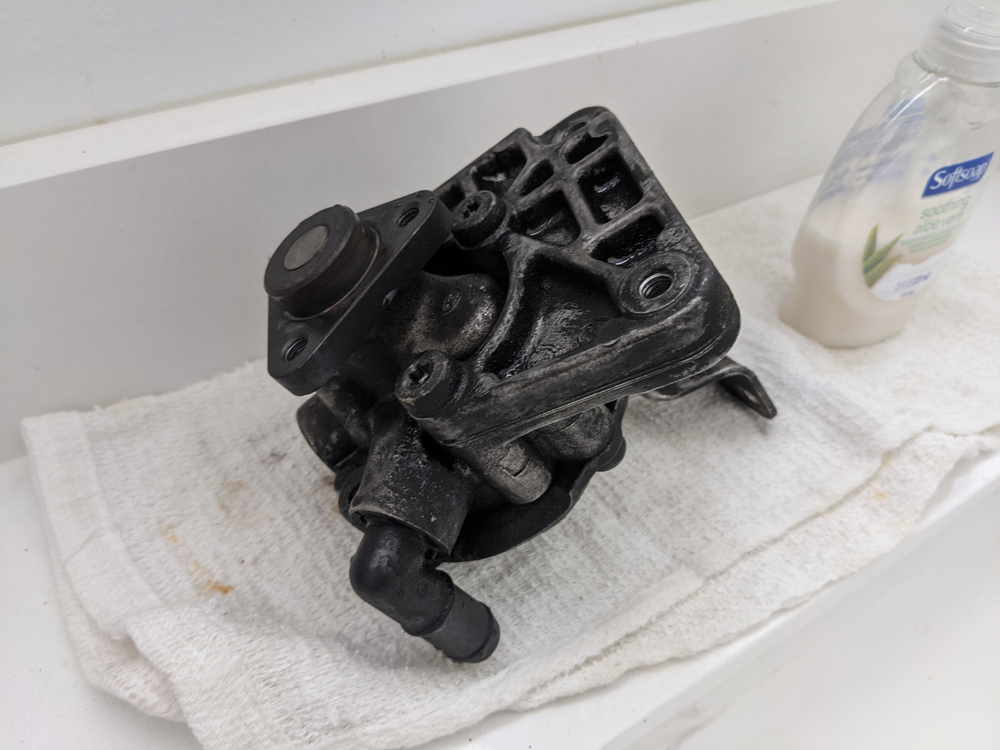
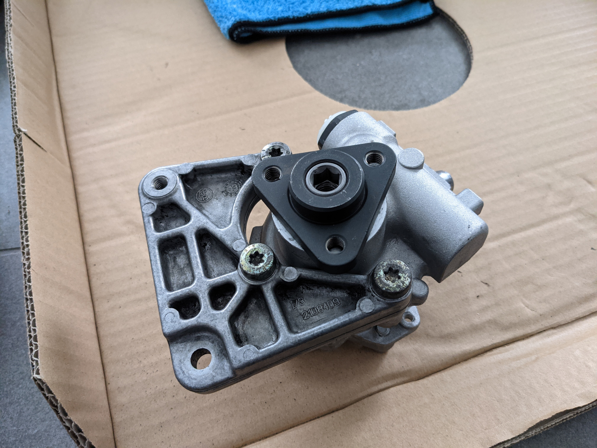
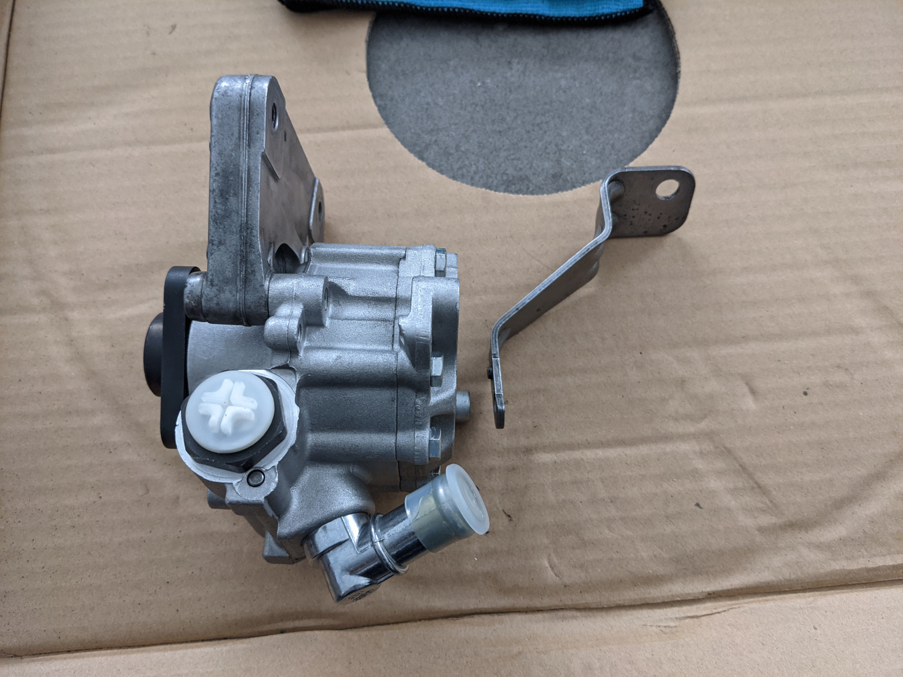
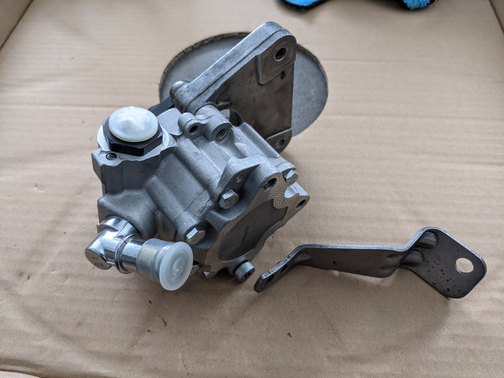

## Intro

When I picked up my E46 coupe from the seller and drove it home, I noticed the power steering system would make a groaning noise whenever I turned the wheel at a standstill or low speeds. Now that I have the car on jacks, I decided to replace the entire power steering system (hoses, reservoir, and powers steering pump). 

The OEM pump that's in my car is the LUK LF20 style pump. On the various forums, this pump is better regarded in terms of steering feel but has a mechanical flaw in the vane to shaft design that causes it to shear off. With this in mind, I opted to take the cheap upgrade route to a LF-30 upgraded style pump. Here is some information about the upgrade you might find useful.

## Important Upgrade Information 

The car I performed this upgrade on is a 2001 325Ci that comes stock with the less robust LF-20 pump. The replacement LF-30 pump I got is a cheap, aftermarket one from Amazon. I took a gamble on this simply because the Meyle version I wanted was not in stock and I did not want to wait. The price was also reasonable and I am hoping the better design even on a cheap aftermarket copy will suffice.

The Amazon LF-30 style pump I chose to install.

Due to the different design, cars that came with the OEM LF-30 pump have different style brackets. My concern for this upgrade was whether I would be able to use the LF-20 style mounting brackets on the new LF-30 pump.

The OEM LF-20 pump removed before cleaning

The aftermarket LF-30 pump with the OEM LF-20 front bracket intalled

To my pleasant surprise, the LF-20 front bracket fits without an issue. The only issue is the rear bracket. While the rear bracket can be bolted to the pump, the bracket does not line up with the bolt hole on the engine block. A custom bolting solution will be needed for the rear bracket.

Rear bracket

The rear bracket's mounting hole to the engine block does not line up

