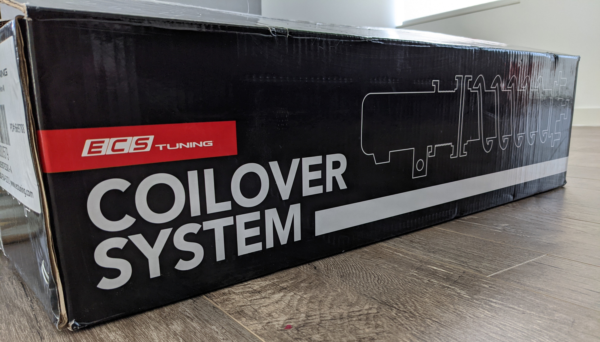
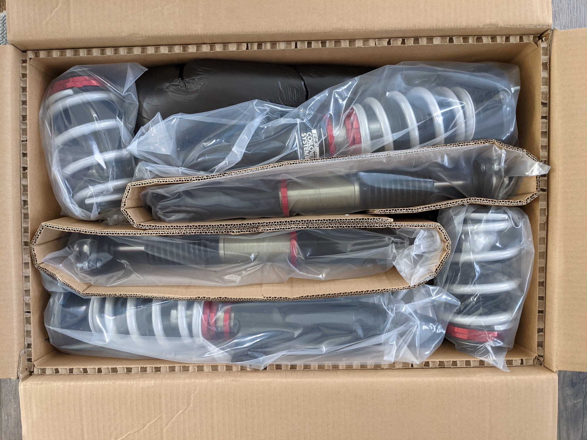
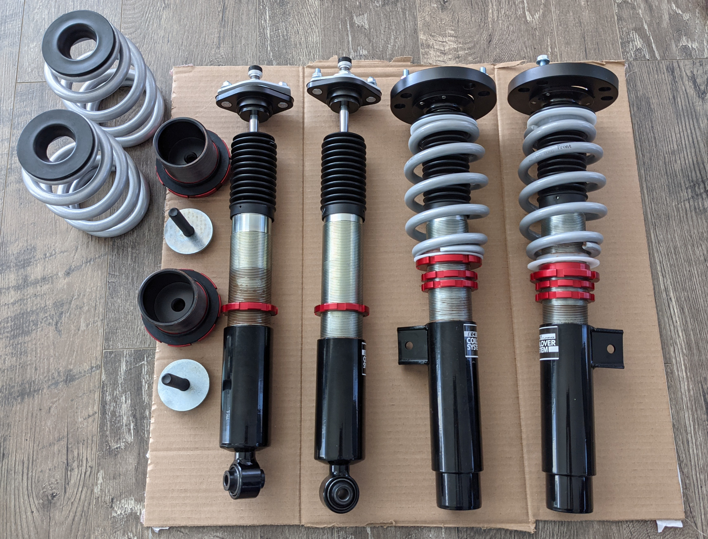
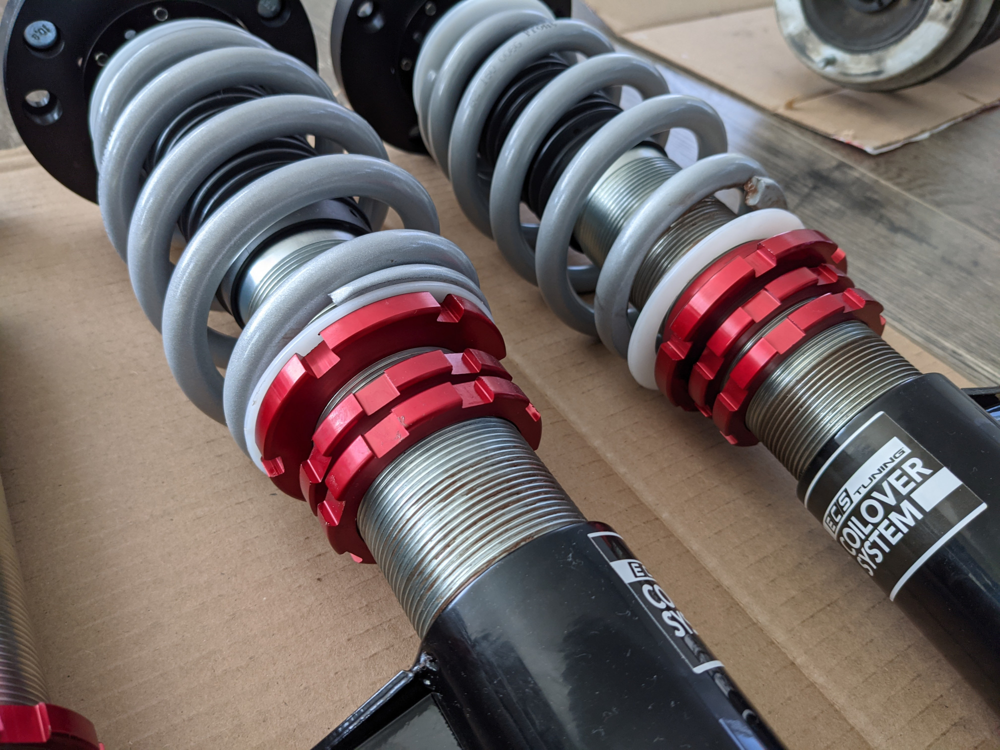
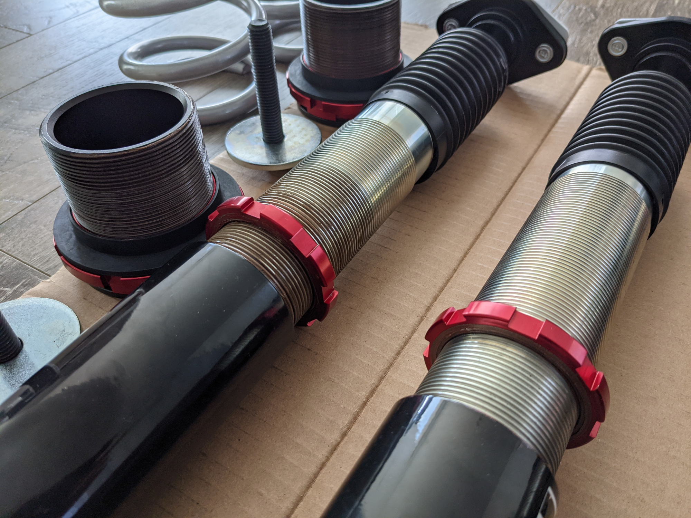
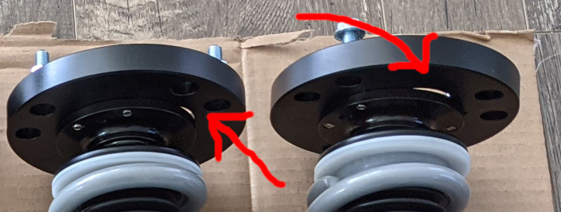
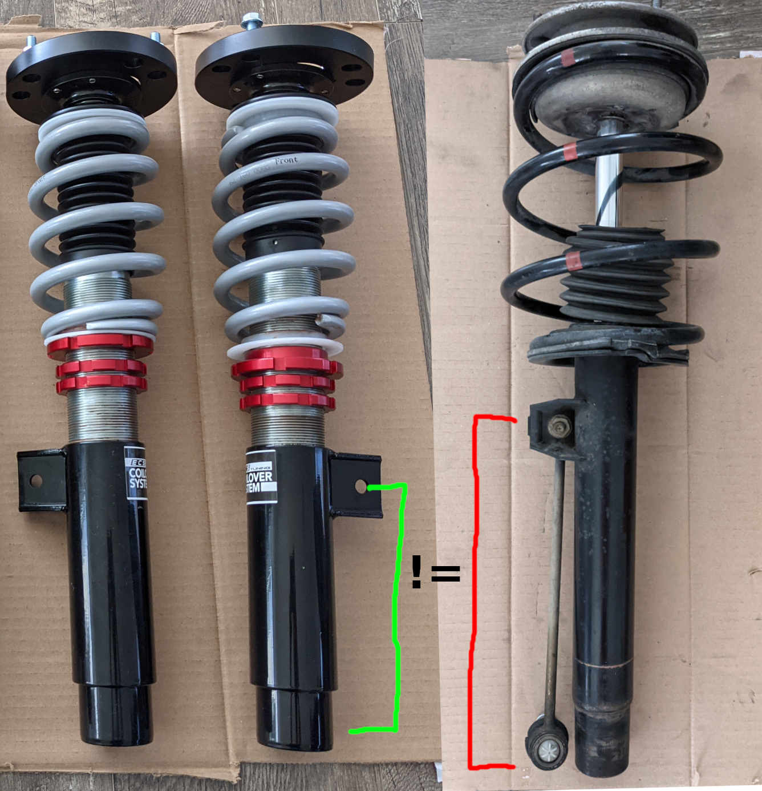
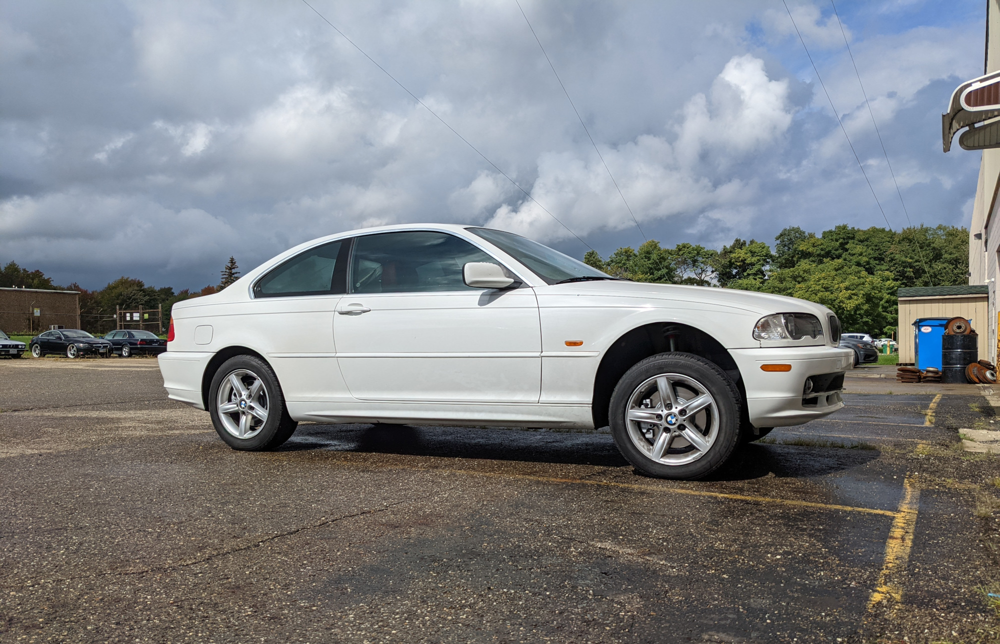
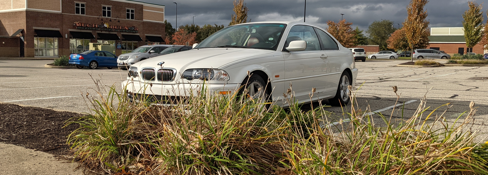
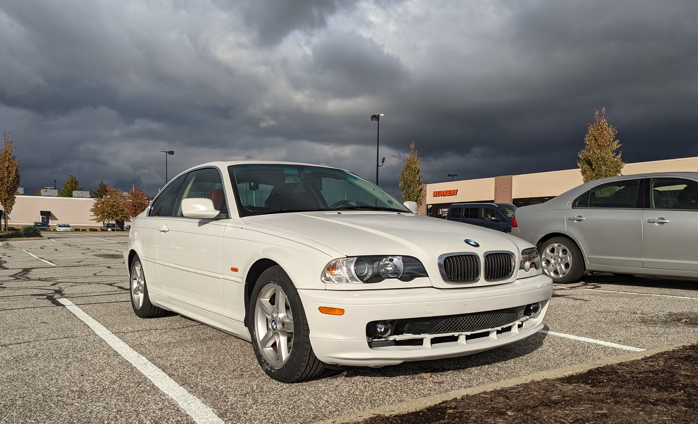

## 8 Month Update April 22, 2022

After having daily driven the ECS Tuning coilovers on my stock 325ci for nearly 8 months, I can now confidently say that they are indeed much too harsh for the pockmarked and rough roads of the midwest. On perfectly smooth roads, these coilovers are great and comfortable, but at the slightest perturbation in the road, the comfort declines drastically. The coilovers clunked a lot and the added stiffness and lack of suspension spring travel put too much torsional stress on the chassis. I would often hear the chassis make noises when going over uneven surfaces at an angle. I would be scared the rear glass would crack due to the chassis flex. 

I have now returned to the stock springs and upgraded to Bilstein B4 touring strut/shocks. The ride comfort is vastly better for daily driving and the B4 provide enough stiffness for spirited driving in the corners.

## Intro

In my previous post, I had outlined a long list of things I had planned to do on my neglected, high mileage E46 coupe summer project. At long last and a little delayed, the car has been fully restored and refreshed. As part of the refresh, one of the components I failed to find adequate information on were the revised ECS Tuning branded coilovers for the regular E46. Feeling adventureous, I decided to bite the bullet and spend the ~$700 on the coilover kit to test out for myself. The product in question can be found here: https://www.ecstuning.com/b-ecs-parts/ecs-coilovers-e46-non-m/029307ecs01~a/. 

I would like to preface this review by explicitly stating I did not receive any compensation or freebies for this review from ECS. I bought this kit with my own money, so you can be assured this is as unbiased of a review as possible on the internet. 

With that disclaimer out of the way, I insisted on the ECS Tuning coilovers for several main reasons: name brand, advertised to be comfortable for daily driving on par with an OEM setup, ability to maintain stock ride height. The ECS brand carries some weight and legitimacy, so I decided to put their claims about this coilover kit to the test since my focus for this car is to improve handling while maintaining OEM comfort found in the Sachs dampers.

## Unboxing

The coilovers arrive in a thick, well packaged box that presents itself very well. 

These are all the components of the coilover kit. The brown coating on the threads is copper anti-seize that I have applied to prevent the collar screws from binding if I ever wanted to adjust the height and/or preload.

## Install Review

Without a doubt, the coilovers are a very nice unit that look and feel high quality. However, there are some issues I had during the install that annoyed me enough to reconsider this kit.

### Issue 1: Front Camber Plates

There are two main issues I have with these coilovers, both of which reside with the design of the front coilover unit. The first issue is rather minor and shouldn't be a problem for most users. I however noticed it and felt a lack of refinement of the unit. This issue is regarding a small gap between the camber adjustment plate and the main shock tower mounting plate as denoted by the arrows in the image below.

This will not be a problem for people who live in a dry climate, but I think the product can be refined a bit if the camber plate's diameter were increased ever so slightly to seal that gap to prevent water from splashing up into the engine bay during any sort of inclement weather. 

### Issue 2: Front Endlinks

The second, and biggest issue I had during the installation is the inability to use OEM length sway bar end links. This issue is compounded more by the fact the kit does not come with a custom set of endlinks to make it work. I find this a huge oversight in this kit especially since it is marketed to be an OEM+ solution for those who intend to daily drive the car and conesquently are more likely to retain the factory ride height. 

To better illustrate this issue, I have noted the problem in the image below with the OEM shock/spring side by side with the ECS coilovers.

I have denoted the distance between the endlink mounting hole to the place on the shock mount that is required to maintain the stock ride height. The distance in lime green for the ECS coils and the distance in red for the OEM shock are vastly different, which prevents the use of OEM length endlinks. The OEM length front endlinks measure about 27cm from bolt to bolt while the ECS coilover endlink that I had to source from Amazon ended up being around 8-10cm from bolt to bolt. 

In my opinion, this is a huge problem with this coilover kit that prevents it from being a complete kit for an OEM oriented setup. I think ECS should specifiy the details of this better on their product page or change the marketing altogether as it is not daily driver friendly installation wise. The other option is to include the custom length endlinks that work with stock to minor drop in ride height (I'm talking very minor drop like 2-4cm). 

## Performance Review

### Getting it Configured

This was my first time installing coilovers on any car, so naturally despite all my efforts of trying to make it as stock as possible, the ride height was messed up - very badly. I've been told this is what's known as a "Carolina lean." Nonetheless, the car was dropped off at a local BMW speciality shop that remedied the suspension back to stock height, camber, and basic spring preload setting. The adjustable damper knob on all 4 were also set to the max soft setting.

Before

After

As mentioned earlier, my performance review of these coilovers place a heavier importance on comfort and daily driver performance over track and spirited driving as that is my priority. 

### How Do They Perform?

As of this article's publication date, I have now put close to 400 miles on the ECS Tuning coilovers riding on stock 16in 205 wide BMW Style 5 wheels and General GMAX-RS tires. I have driven the car on rough city roads, smooth highways, and some mild twisties. My summary of these coils in various segments are as follow:

* Comfort: very rough on normal road imperfections, fine on smooth highways
* Handling: the car remains flat and composed through the curves and notably increases the performance envelope. 
* NVH: the roughness of the coilovers seem to transmit more noise through the cabin, especially over bumps.
* Value: for ~$700, they are not a bad deal if you are willing to sacrifice comfort. I think they'd be great for autox and track days

### Final Verdict

Overall, the ECS Tuning coilover kit for the non M E46 is a decent kit tarnished by poor/improper marketing and the lack of suitable endlinks to reflect the marketing for daily drivers. The paint finish is very nice and all the parts bolted to the car without any issue. These are coilovers, so I cannot critize this kit too much for the lack of comfort. However, I think the product description should not emphasize the daily driver aspect and supposed "increase in comfort" gained from these coilovers. 

It was a nice experience learning about suspension tuning and setup, but I have decided that I will be returning to OEM Bilstein or equivalent shocks/dampers for next year's summer driving season on this car. 

