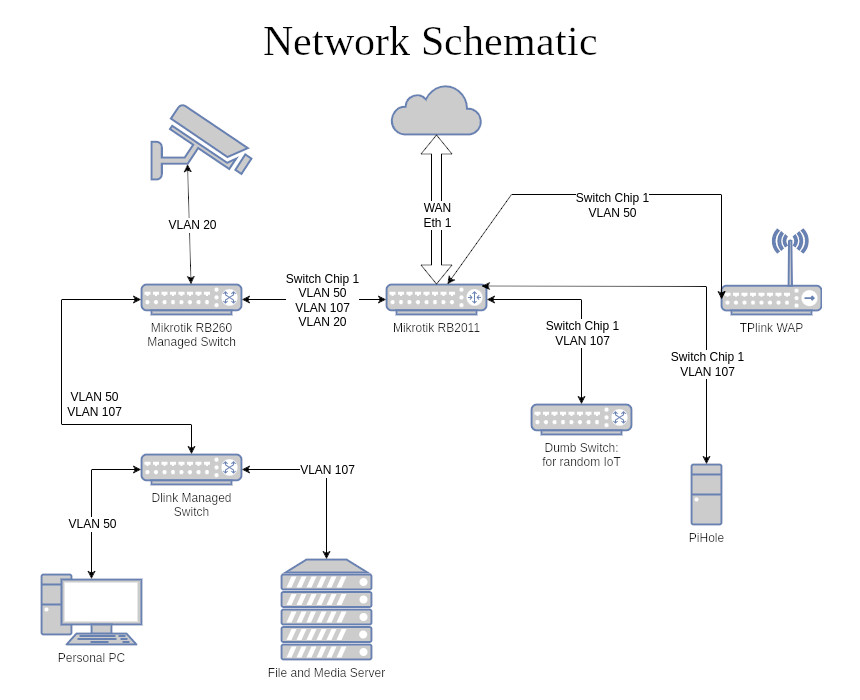
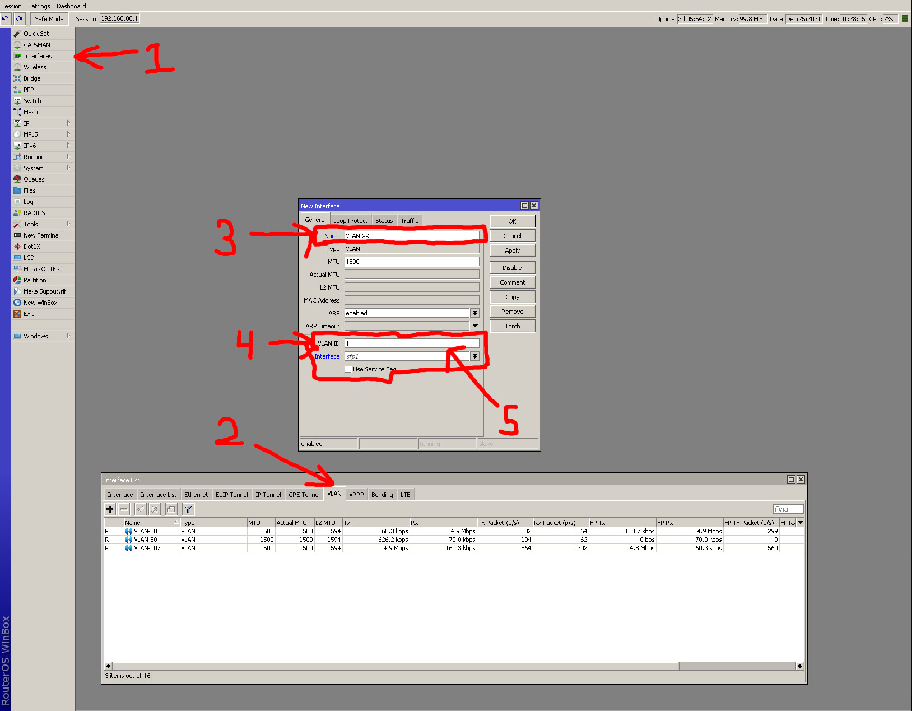
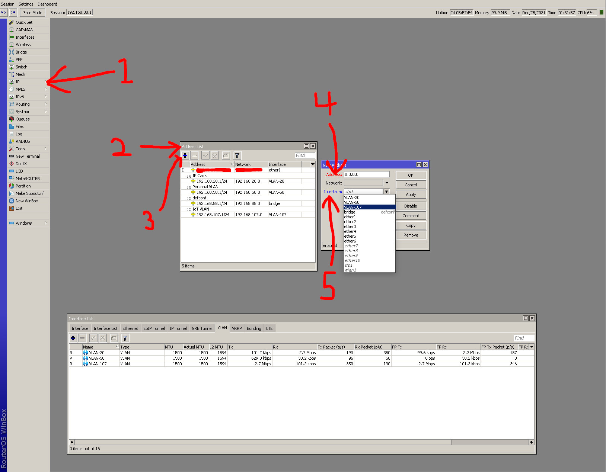
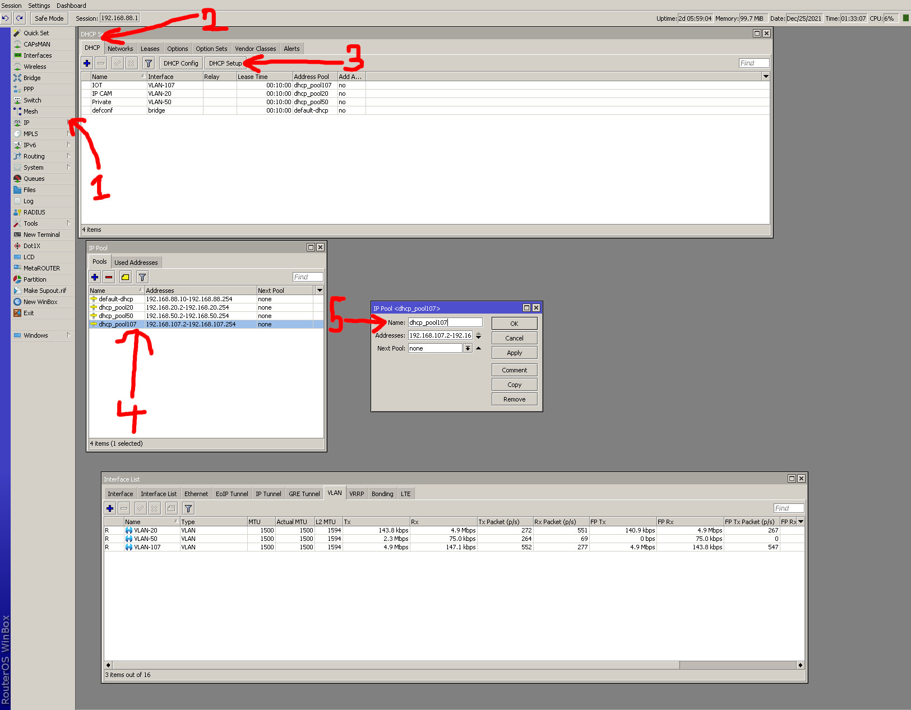
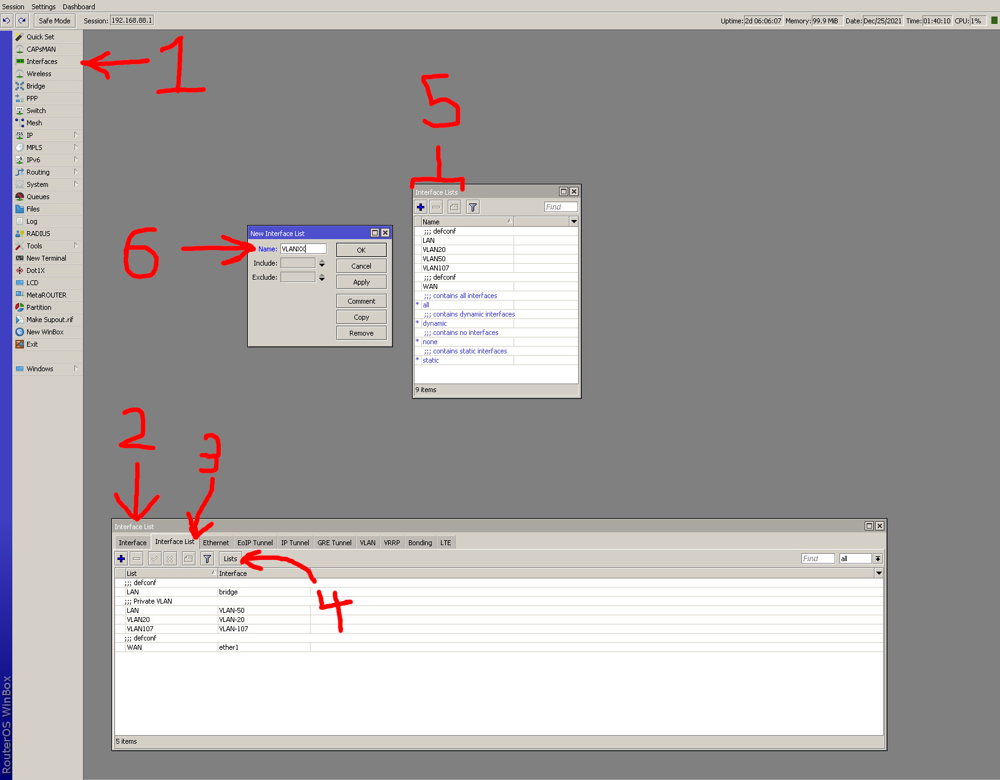
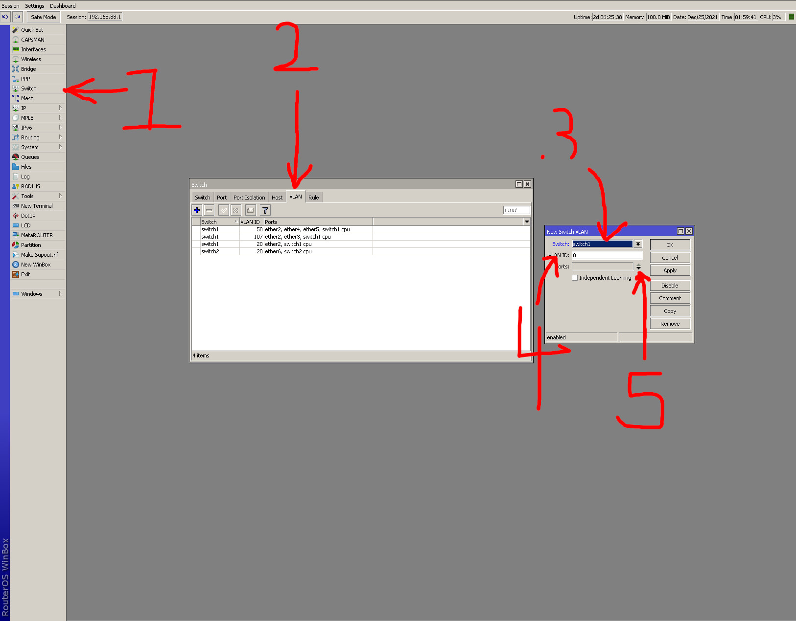
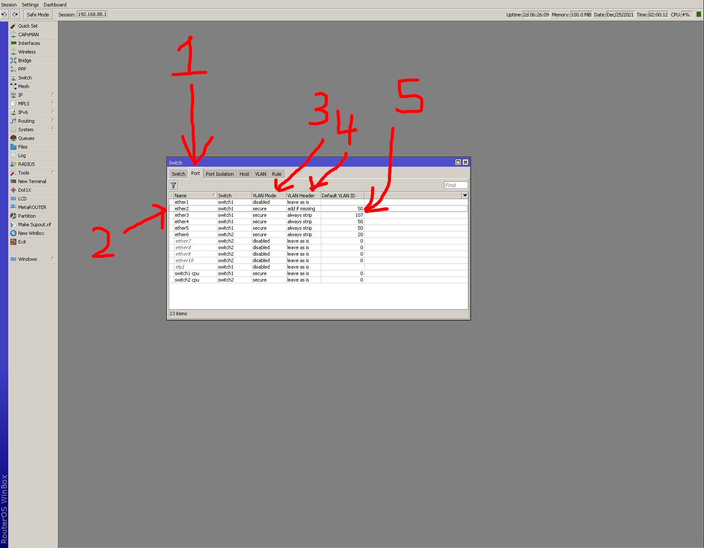
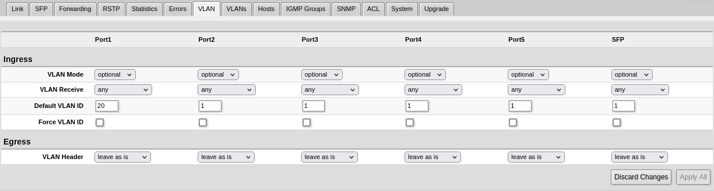
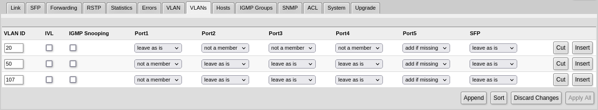
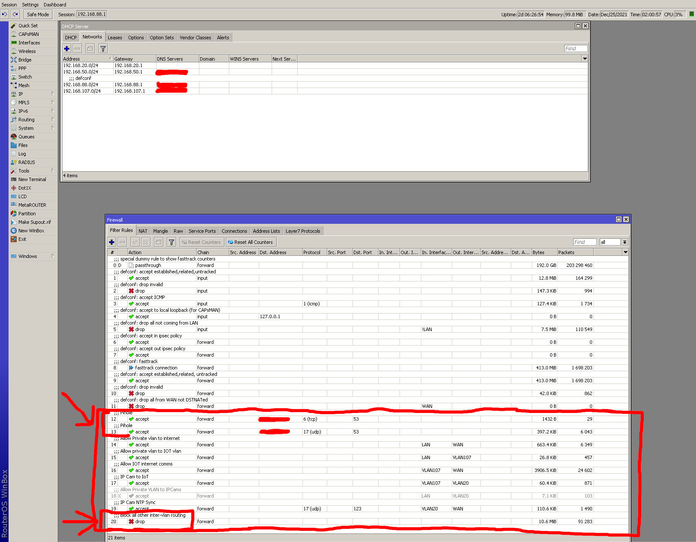

## Intro

In my previous post, I had detailed a rather rudimentary guide to setting up VLANs on the Mikrotik RB2011 series of routers utilizing the switch chips. As an end of year network audit, I found that the setup I had been using was incomplete and consequently, the first guide on this website is also lacking. To remedy this error, this is version 2 of the RB2011 VLAN guide. The following steps assume you start on the default configuration of the router.

This guide will cover the following topics:
* VLAN creation on the router using trunk, hybrid, and dedicated ports 
* implement managed switches and wireless access points using multiple VLANs
* enable a rudimentary IPV6 setup to function on the respective VLANs
* secure IPV6 and IPV4 firewall setup
* the addition of a Pihole DNS sink to function with the VLANs and firewalls


### Network Summary



In my network, I will utilize 3 VLANs, VLANs 20, 50, and 107. All of these VLANs go through the 5 gigabit ports on the RB2011 router that utilize switch chip 1. Eth 1 connects to the ISP provided modem. Eth 2 connects to a managed Mikrotik RB260 switch. A different dumb switch connects on eth 3 the Raspberry Pi connects on eth 4, and a VLAN aware wireless accesspoint connects on eth 5 on the router. From the RB260 switch, a second Dlink managed switch connects to it, with VLANs 50 and 107 being run through it.


## Part 1: Setup VLANs On The Router

The network I want to create is more involved than the usual guides, but should provide enough information to be able to add multiple managed switches to the network design of your choice. A diagram of the network we will create in this guide is shown below:

To begin, login using the Winbox utility and change the default passwords and update to the latest RouterOS. If you have the RB2011 router with wireless, disable the wifi interface to turn it off. Ideally you want to connect to the router using the marked comms port (eth 8) while configuring your VLANs.

### Create The VLANs



As shown in the main network schematic, we will create three VLANs. VLAN 50 for personal, VLAN 107 for IoT devices, and VLAN 20 for my IP cameras. To do this, in the left hand column, click Interfaces -> VLAN. Then click the + button to add a new VLAN. In the new VLAN Interface window, give the VLAN a name, the ID (the numeric ID eg. VLAN 20 will have ID of 20), and for the interface select "bridge." The bridge interface essentially acts as the software bridge that connects all the ports on the router together. The VLANs sit on top of that bridge and in the current RouterOS firmware, the hardware offloading still occurs on this bridge.


### Create Address Range for VLANs



Next, we need to create the address ranges for each VLAN created. Click IP -> Addresses to open the window. Click the + button to add the addresses. In the New Address window, suppose we want to add the full address range on using the 50 subnet for VLAN 50. This is denoted as 192.168.50.1/24. Lastly, under the "Interface" drop down, select the associated VLAN interface created earlier for the address range.


### Create DHCP Server For VLANs



After creating the address range, we need to create the DHCP server and pool for each VLAN. To do this, click IP -> DHCP Server -> DHCP tab. Then click "DHCP Setup" and walk through the setup. The defaults should be correct.

#### Rename Pools (optional)

After the DHCP Setup completes, it's not a bad idea to change the DHCP Pool name for ease of readability. To do this, click IP -> Pools. Double click on the pool with the associated address range and rename to your liking.

### Add Interface List for New VLANs



Lastly, we need to create the interface list for each VLAN so that we can configure the private VLAN and group the VLAN interfaces into lists to use in the firwall rules. To do this, click Interfaces -> Interface List -> Lists -> +. In the Interface Lists, click + and simply give a name for each VLAN. Then, go back to the main Interface List window, double click each of the newly created lists and make sure the list name corresponds to the actual VLAN interface created in the earlier step. For the private VLAN (VLAN 50 in my case) change the List column to be LAN in order to be able to access Winbox from the private VLAN.


## Part 2: Configure Switch Chip

### Switch Chip VLANs



The second part consists of configuring the switch chip since the RB2011 has hardware capable VLAN switches. Click Switch -> VLAN -> + to create a New Switch VLAN. In the window, select "switch 1." As seen in the schematic, let's first configure VLAN 50. In VLAN ID field, put 50. Click the down arrow in the Ports section and select ether2, ether4, ether5, and switch1 cpu. This signifies that VLAN 50 traffic can be routed on ether ports 2, 4, and 5. Use the same logic for the other VLANs and the ports you want to assign them to.

### Switch Chip Ports Assignment



Next, click on the Ports tab. We want to edit each port's VLAN Mode, VLAN Header, and Default VLAN fields as shown in the columns. To edit those fields, double click the row of the port you want to edit. Let's configure the VLAN rules for ether2. To review, ether2 is to carry VLANs 50 and 107. These VLAN tags will be known, so we set the VLAN mode to secure, VLAN Header to "add if missing", and default VLAN ID to 50 (since this is the primary, private VLAN).

Secure as defined by Mikrotik is: checks tagged traffic against the VLAN Table for ingress traffic, drops all untagged traffic. Both ingress and egress port must be found in the VLAN Table for the appropriate VLAN ID, otherwise traffic is dropped. Add if missing as defined by Mikrotik is: adds a VLAN tag on egress traffic and uses default-vlan-id from the ingress port. Should be used for trunk ports. These correspond to the kind of traffic coming through ether 2. 

Next, edit the remaining ports as shown in the screenshot above to achive the VLAN configuration seen in the schematic. Do not forget to change the last two rows' (switch1 cpu and switch2 cpu) VLAN Header to secure for all the VLANs to work.


## Part 3: Configure Managed Switches



Now, we need to configure the RB260 managed switch. Login to the switch from the browser and click on the VLAN tab. I made port 1 strictly to use VLAN 20, so the default VLAN ID should be changed to 20 for ingress. 



Next, click the VLANs tab and add VLANs 20, 50, and 107. Since 20 only belongs on port1, select port1 to be "leave as is", port5 (the trunk port) as "add if missing", and everything else as "not a member." Port 5 is the trunk port, so all VLAN entries for that port is "add if missing." For VLAN 50, port1 is not a member, and the remaining ports except 5 are "leave as is." The same rules are applied to VLAN 107 because this will allow VLAN tags of 107 to run through ports 2-4, while defaulting to 50 if not specified.


## Part 4: Configure Pihole DNS Settings (Optional)

If you have a Pihole setup on your network, I have decided to add it to the VLAN 50 network. For this case, replace **to-address**, **src-address**, and **dst-address** with the IP of the Pihole device. To allow this to happen for all devices on the network, open the terminal in Winbox and add the following firewall NAT rules:

```bash
/ip firewall nat
add chain=dstnat action=dst-nat to-addresses=PIHOLE protocol=udp src-address=!PIHOLE dst-address=!PIHOLE dst-port=53
add chain=dstnat action=dst-nat to-addresses=PIHOLE protocol=tcp src-address=!PIHOLE dst-address=!PIHOLE dst-port=53
    
add chain=srcnat action=masquerade protocol=udp dst-address=PIHOLE dst-port=53
add chain=srcnat action=masquerade protocol=tcp dst-address=PIHOLE dst-port=53
```

With the blanket blacklist firewall principle, an additional two rules need to be added for the Pihole to work, which is explained in the next section.


## Part 5: Configure IPV4 and IPV6 Firewall Rules



Lastly, we need to secure the traffic flow with firewall rules for both ipv4 and ipv6. The principle I like to use for firewall rules is a blanket blacklist to block all inter-VLAN routing and access to the internet. This is signified by the last rule in the firewall settings above that states to block all forwarded traffic coming through the router. 

Next, we need to ensure the Pihole will work, so we need to add two rules (one for TCP and UDP traffic) that open all devices on all VLANs to port 53 going to the Pihole's IP address. We also need to change the main DNS settings, so open the DNS window by clicking IP -> DNS. Uncheck **Allow Remote Requests** and add the IP of the address of the Pihole in the **Servers** field. If using IPV6, the Pihole's IPV6 will automatically be filled in. Finally, click IP -> DHCP Client, and double click the single row for ether1. Uncheck Peer DNS.

### IPV6 Rules

[Coming Soon]


## References

1. https://danservices.com.au/support/mikrotik-vlan-configuration-2020/
2. https://wiki.mikrotik.com/wiki/Manual:Switch_Chip_Features
3. https://wiki.mikrotik.com/wiki/SwOS/RB250-RB260-VLAN-Example
4. https://www.reddit.com/r/mikrotik/comments/7r2rqf/accessing_webfig_or_from_winbox_on_vlan/dstt7yu/
5. https://forum.mikrotik.com/viewtopic.php?t=144865
6. https://erikthiart.com/blog/force-all-dns-traffic-to-go-through-pi-hole-using-mikrotik
7. https://www.medo64.com/2018/03/setting-ipv6-on-mikrotik/
8. https://help.pentanet.com.au/hc/en-us/articles/4403292124691-How-to-configure-a-MikroTik-RouterBoard-router-to-accept-IPv6

