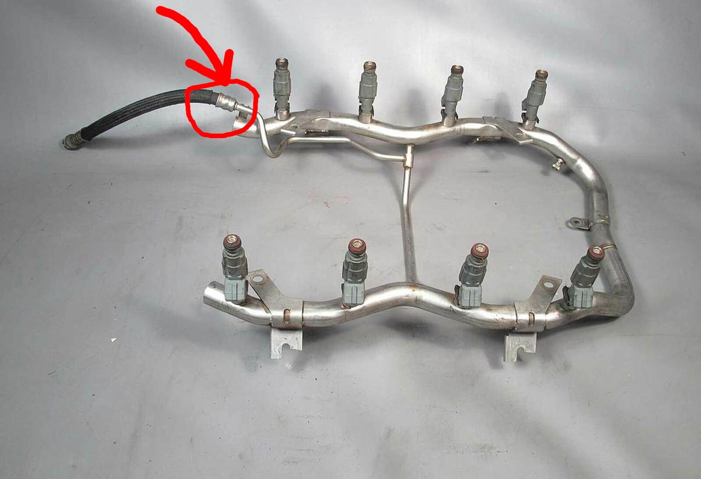
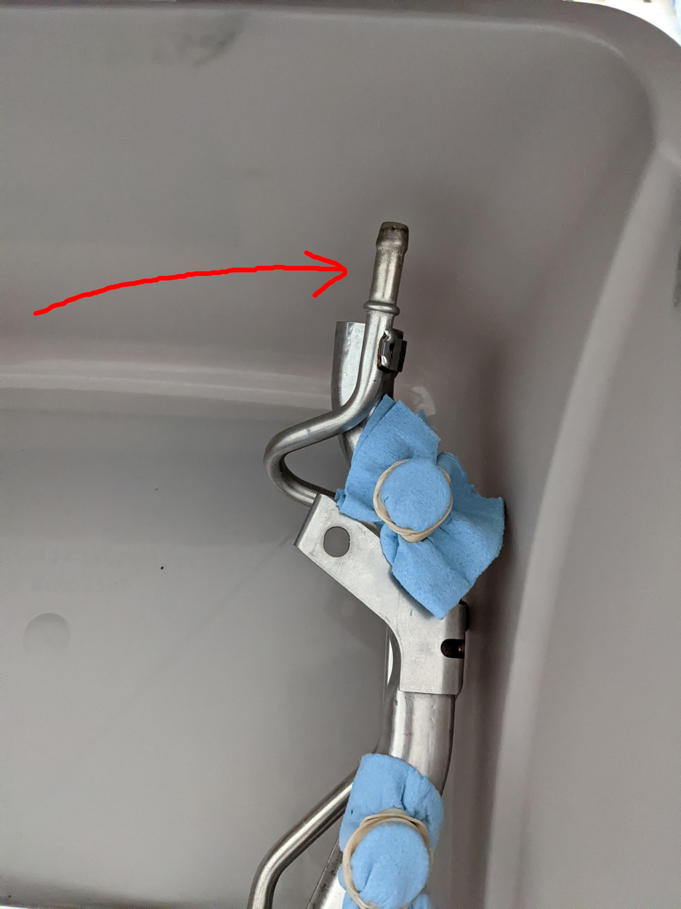
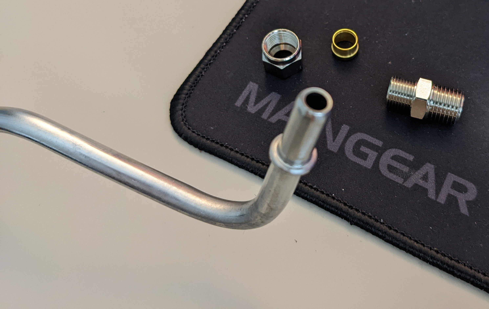
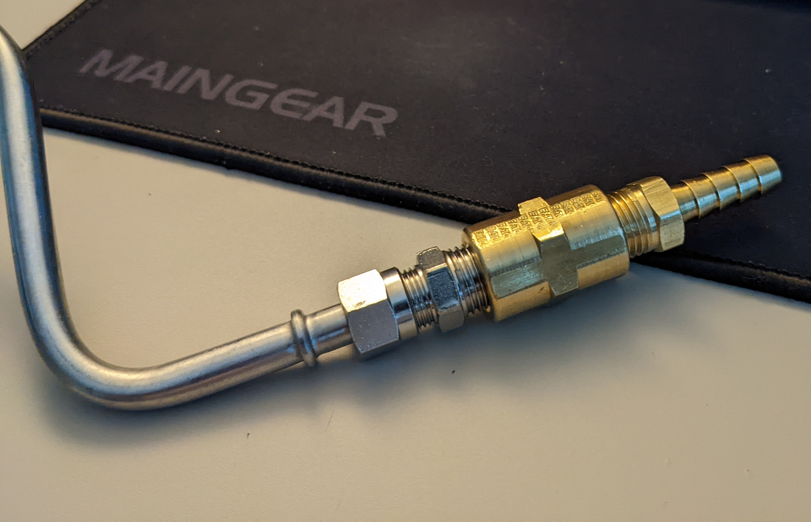

## Addendum To The Solution

While replacing the other crimped hoses on the car, I revisited the fuel hose solution. I am a proponent of the KISS (keep it simple, stupid) philosophy and opted to remove the complicated crimp setup on the fuel line coming from the filter. To simplify the hose attachment, the simpler solution is to simply create a raised ring around the metal tube where the fuel hose attaches. This is accomplished by applying a small ring of JB Weld to create the bulbous barb seen on the fuel rail end. This simplifies the attachment and reduces a possible failure point for leaks.

## Intro

The BMW E38 7 series is now approaching classic status with the earlier model years already at 25 years of age. As the E38 generation approaches nearly 2 decades on average, it is important to replace the numerous wear and tear items that decay with age, most notably fuel hoses. 

## The Problem

The fuel rail on the M62tu engine poses a slight problem in this restoration of fuel hoses. The problem lies in the design of the rubber fuel hose that connects to the fuel rail: it is crimped on the rail and terminates with a BMW quick connect fitting. This post documents how I go about replacing this hose without spending the hundreds on a new fuel rail and hose part from BMW.

## The Solution

The solution is actually very simple. All that needs to be done is to use a dremel or similar cutting tool to cut a slit on the metal piece that crimps the tube to the fuel rail. Once the crimp is removed, it will allow you to remove the old rubber fuel line and crimp. 

As can be seen, you have a standard dimple end you can slide your replacement 8mm ID fuel hose and use regular fuel hose clamps to secure. This same process can be used for the transmission oil cooler lines to replace the transmission oil hoses. 

## Where it Connects on the Car

That's all great, but there's still one small problem. the connection from the fuel rail to the car still uses the quick connect fitting, which we have forgone for a simpler hose and clamp solution. To address this, you will need an 8mm OD compression fitting, a coupler, and a barbed fitting. You basically screw them on and tighten them to the metal fuel pipe and voila, the connections are solved! You do not need to use a thread sealant as the threads on these fittings deform when torqued down, creating the seal. Thus, they are one time use if you take the fittings apart. 

