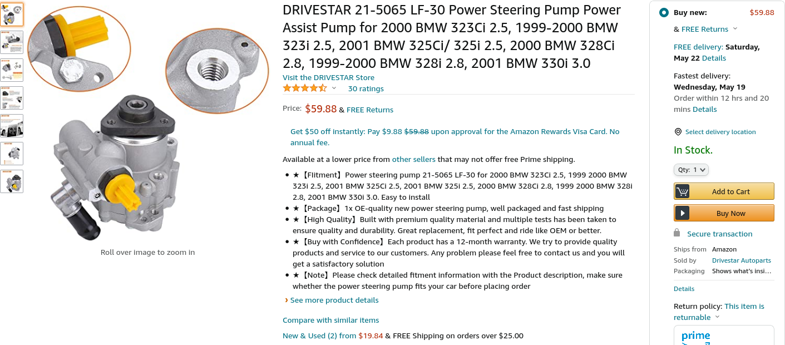

## Intro
Earlier this year I decided to switch my power steering system in my E46 325ci to the LF30 style pump due it apparently having a more robust design. The LUK branded new pumps at that time were on backorder and still seem to be backordered. I therefore bought a cheap one from Amazon and have now been using it for almost a year.

## One Year Review
Since installing this pump, I have driven my car almost 10,000 miles and taken it through some very spirited routes in the Smokey Mountains. Compared to my failing original LF20 pump, this pump did solve the groaning noises I had before. However, after the pump was broken in, I have found the higher pressure of the LF30 pump is not seeming to translate to the steering wheel input. In fact, the steering effort required at standstill is a lot more than before. During my winter maintenance period, I will be replacing this pump with a different brand LF30 from RockAuto with the hope of restoring the boosted, efforless steering expected from a BMW.
