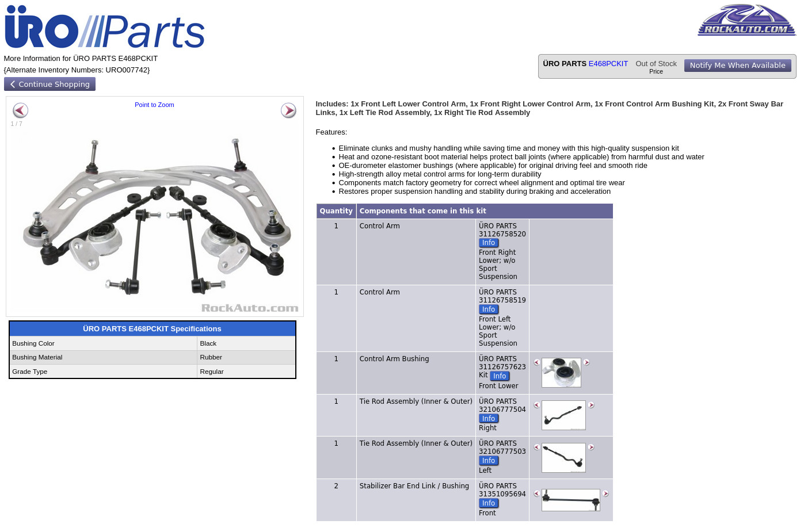

## Intro
Back when I was performing the full refresh on my neglected, zero maintenance history 325Ci, I opted to save some money and bought the Uro Parts full front suspension kit from Bimmerworld. The same kit is available on RockAuto, the ad of which is shown here. I had purchased it for $245, which seemed like a good deal for control arms, bushings, tie rod inner and outers, and sway bar endlinks. I had installed these parts approximately a year ago from this post's date and have now come to a verdict on the parts. 

## Uro Suspension Kit Review
Installing the parts on the car was an unsurprising task. After everything was installed and the alignment performed, I was quite satisfied with the parts. The car's front end felt tight and solid. My driving style was only normal street driving with little to no sport driving. It would not be until the summer of this year that I would take the car through its paces on Route 129 to test the front suspension.

## Smokey Mountains Shakedown
Come June, I drove the car to the Smokies and was excited to test the Uro front suspension parts. Up until then, the car handled quite fine for me. During my stay at the Smokies, I drove the car to the limits of its small 205 tires could take it. On the first day at the smokies, everything seemed as expected, though the car felt a little squirrly in the corners, typically during exit. Nearing the end of the first day of driving, the car had developed a strange knocking and clunking sound at low speeds. This noise would not persist oddly enough when the front end was loaded in turns or at steady speeds on the highway. It persisted only at slow speeds. 

This clunking continued for the rest of the time at the Smokies, though the handling did not seem to be significantly degraded than before the clunking. From, then to now, the same low speed clunking persists. I can only assume one of the front suspension components is failing.

## Verdict
The Uro front suspension kit is a good deal. I am actually glad I managed to get a year out of the parts, including some very spirited driving. However, as expected from very inexpensive parts, the quality and durability is not there. The front suspension will be getting properly overhauled for the next season. The realistic lifespan of these parts is really just a year or <10000 miles of normal driving. 
