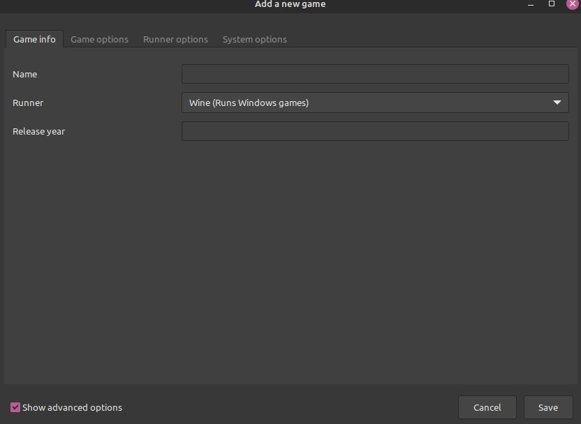
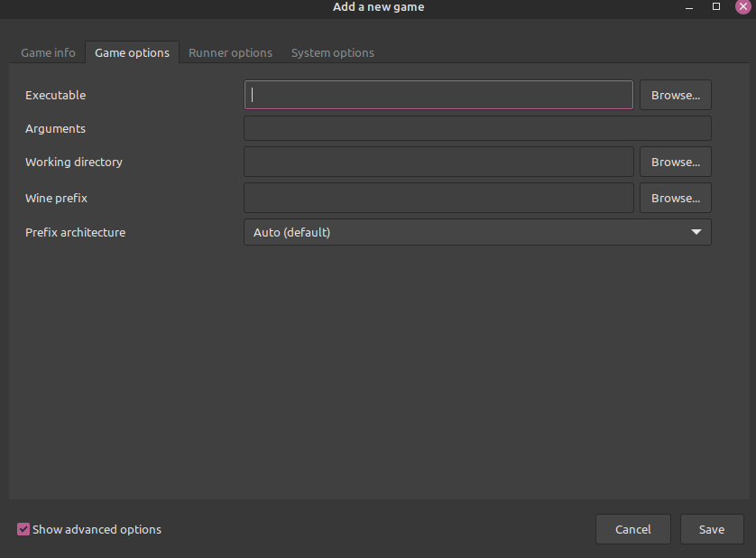

## Intro
Windows is increasingly becoming a hassle to use. Ads in your start menu, spying and telemetry of your local files, bogus hadware security restrictions, and more. Over the past few years, using any variant of Linux has become more than feasible as your daily driver, especially when it comes to playing games. Lutris is a great way to manage and launch your games, even Windows native games as there's a Wine version speficially for playing games using Lutris. This little guide will show you how to install your locally downloaded Windows games.

## Step 1: Setup Lutris
Go to the Lutris website at lutris.net and download the latest version for your distro. If on Ubuntu derivatives, download the .deb and install it on your system. Open up Lutris and under the "Runners" section in the left hand column of the UI, select Wine > Configure. A new window will pop up. Select the latest version of lutris-fshacks and install it. You are now ready to install Windows games

## Step 2: Install a Game
To install a Windows game that you have downloaded locally, click the hamburger menu > install game. You can also click the + icon to open the same window. Select the option for "Add locally installed game." In the new window, enter in the name of the game and under the Runner, select Wine for Windows game. 

Once that has been completed, click the second tab that says "Game Options." There will be a few directories you need to define. For the initial install, the executable and all the game installer files have to in the same directory. Browse to the installer executable for the "Executable" selection. Then, for the "Working directory" option, browse to the directory on your computer you wish for the game to be installed. You most likely will want to manually create this directory. Lastly, you need to specify the "Wine prefix." This is essentially where the Wine version for the game exists. By default if left blank, you will end up installing the game in the default wine install (typically in your .wine folder in your home directory). It is good practice to let the game's wine prefix be the same one as the game's install directory. 

Once done, the game will be added to the Lutris UI and show up in your library. Select it and press "Play." This will launch the installer wizard and install the game in the specified directory.

## Step 3: Final Steps
After the install has been completed, you need to right click on the game > configure > game options. Under "Executable" browse to where the final game folder is and search for the actual launcher for the game. This can be either the .exe file or a .lnk file that links to the .exe. Save the configuration and now enjoy gaming!
