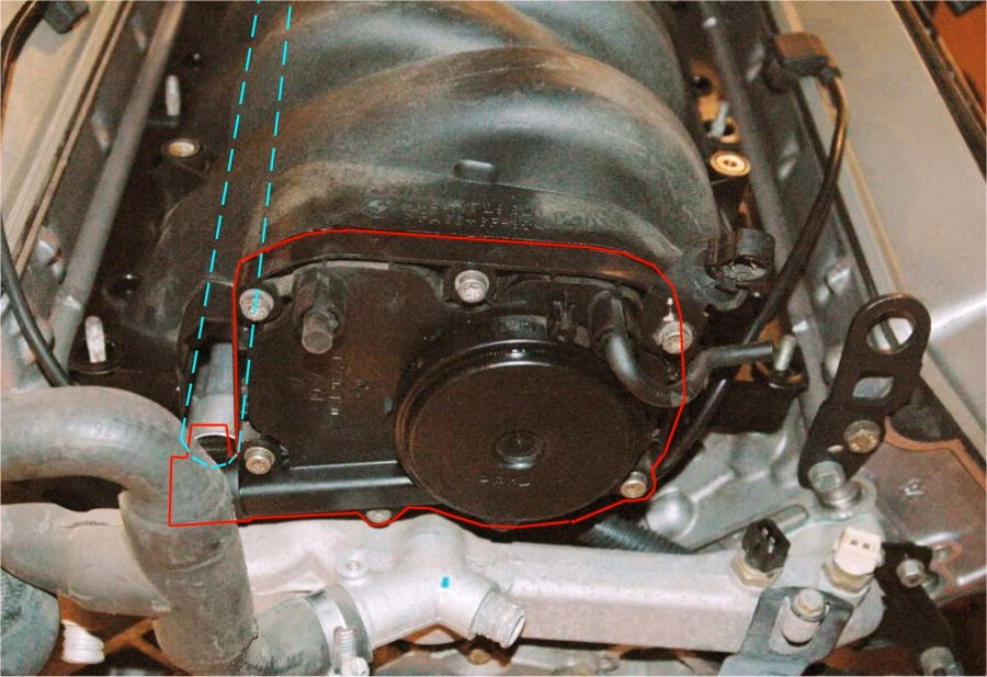
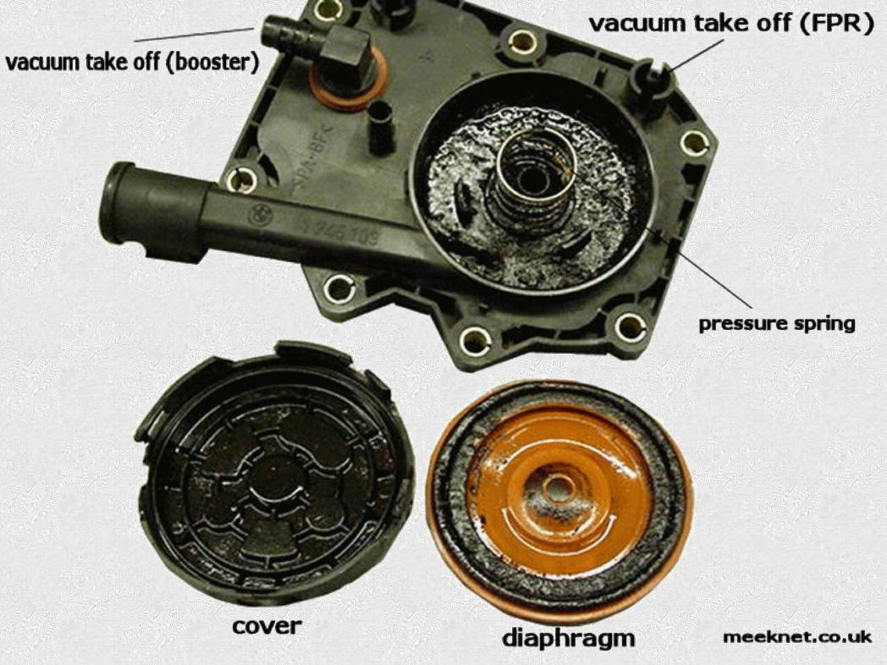
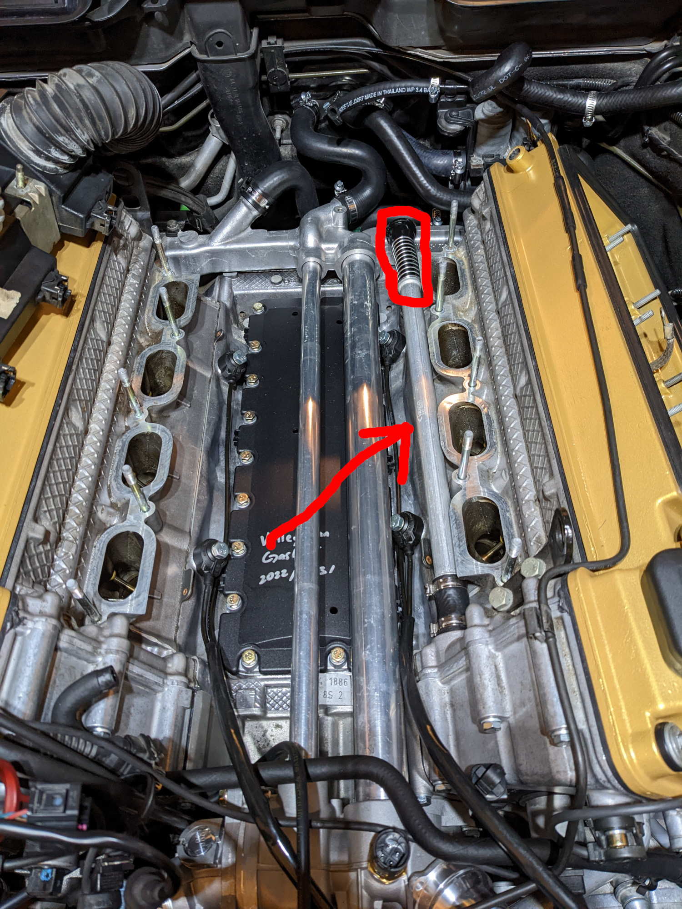
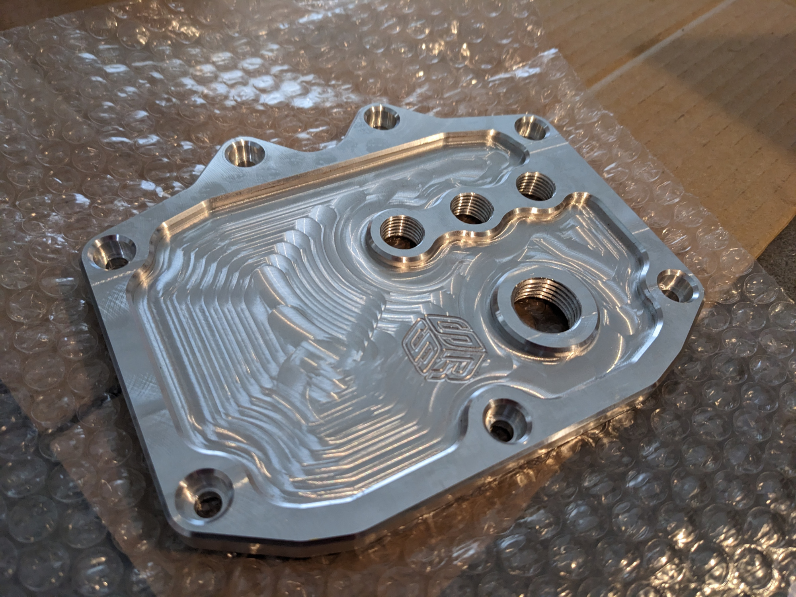
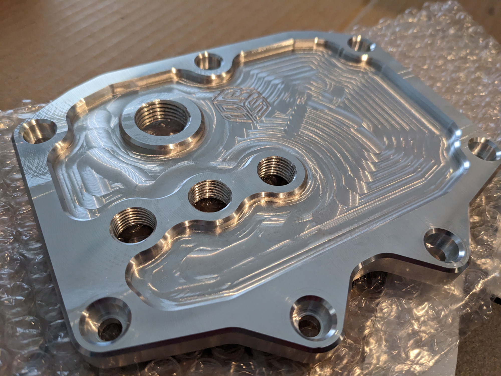
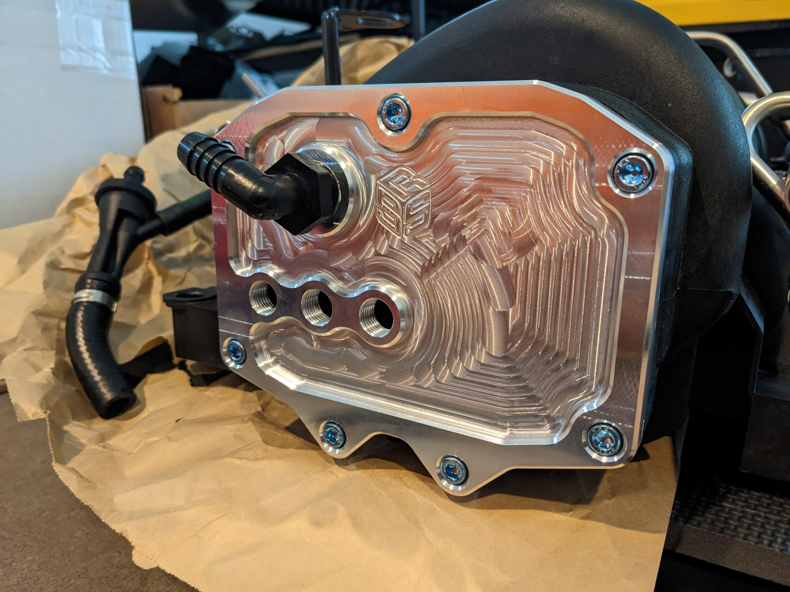
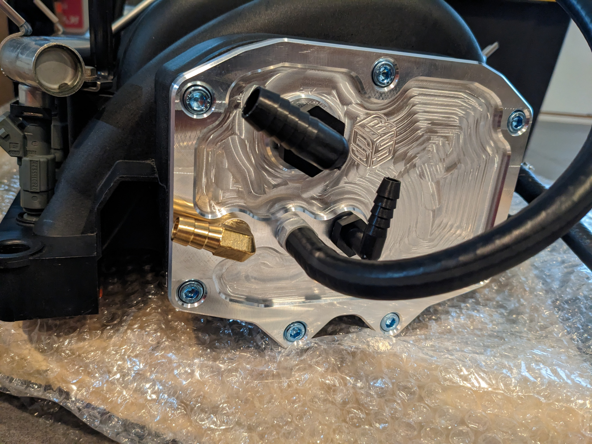

## Intro
The CCV/PCV design on older BMWs from the late 90s to 2000s leave a lot to be desired. The E46 generation with the M54 engine is plagued by faulty CCV hosing and diaphram designs as well as poorly functioning cylinder rings. Having had experience troubleshooting and eventually bypassing the OEM CCV setup, I figured why not do the same on the E38 with its M62tu engine as the design is not that different. 

## The M62tu CCV
The CCV unit for the M62 and M62tu engines is located on the aft of the intake manifold. Courtesy of E38/E31 enthusiast Timm Meeknet, the OEM location is shown below outlined in red. The dashed line in blue is the tube that connects to the CCV from the cyclonic oil seperator that sits in the crankcase (this is the dreaded part behind the timing chain for E38/E39). At this age, both are on their last legs and most likely failing. When they fail, the CCV will end up sucking more oil than it typically does and burns them in the combustion process. This is the cause of the blueish exhaust smoke if these parts have failed. 

Once again courtesy of Meeknet, the internals of the M62tu CCV are shown below. The design is fairly simple, however failure prone. The main issue is the red diaphram ruptures and/or clogs up with oil and moisture. The E46 CCV employs a very similar design and thus has the same failure modes.

## The Problems
You may be asking if the CCV has lasted for 20+ years, why not simply spend the extra for a BMW original unit and replace it? This would be the easiest way to fix it, however the CCV units are no longer made by BMW. I am not talking about aftermarket units made by Vaico, Meyle, and the like. Even the "BMW Genuine" branded unit you see on FCP Euro and ECS Tuning are now made by the aftermarket. I was able to confirm this by purchasing it in its lack of BMW stamped branding and low quality plastic.

This is not the only problem. Let's say you were to keep the OEM designed CCV and OSV and go through the process of replacing the OSV behind the timing chain guides. When all that is done and good, the process of reinstalling the intake manifold is a tedious job thanks to the CCV tube mentioned earlier. Shown below, the tube has to be angled into the CCV port as the intake manifold is lowered on its stud bolts. 

As boxed in red, the plastic spring portion has to be compressed into the CCV's port all while the intake is being lowered. It takes a lot of effort and knowing the eventual failure of the CCV, why go through the hassle of it again and again with the questionable quality and performance of the aftermarket units?

## The SRS Concept Solution
Having thought through these problems and a desire to keep this old gal running for years to come, I opted to bypass the CCV and install a catch can. This however is not so simple as it is on the M54 engine, which has been well documented on the forums. Since the CCV also forms as the backplate for the intake, one cannot simply trash the CCV unit. A backplate has to be made that seals the rear of the intake while also providing ports to run the existing vacuum lines. One of the best products on the market that accomplishes this is the CCV Delete plate from [SRS Concept](https://srs-concept.com/). 

Though it is a niche product, Simon at SRS Concept was very helpful in answering my questions and providing great customer service as I ordered from them. The part is a CNC milled piece from aluminum that provides 1 1/2in NPT port and 3 1/4in NPT ports. 

The part is very well made and is a great way to more easily bypass the CCV and install a catch can on the M62tu. 
