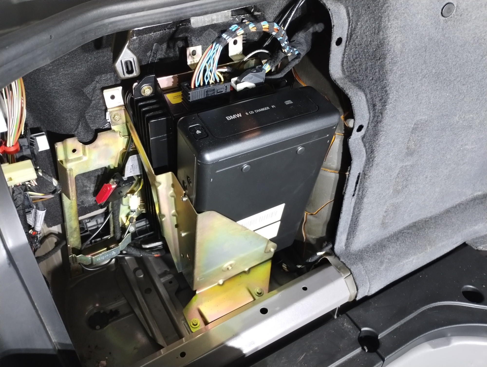
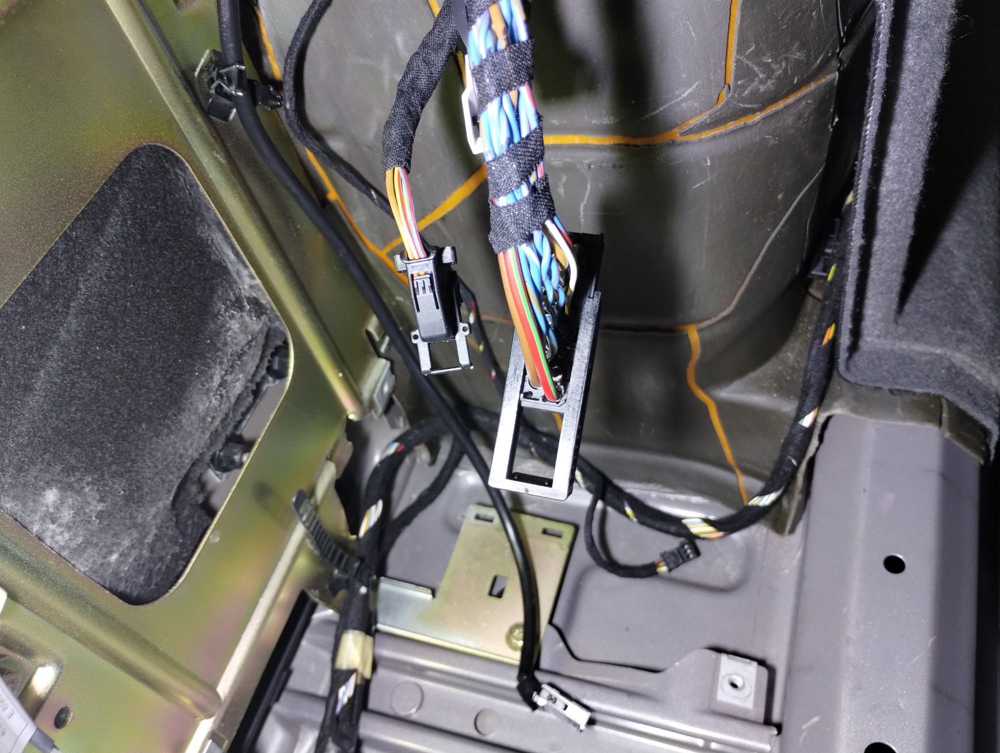
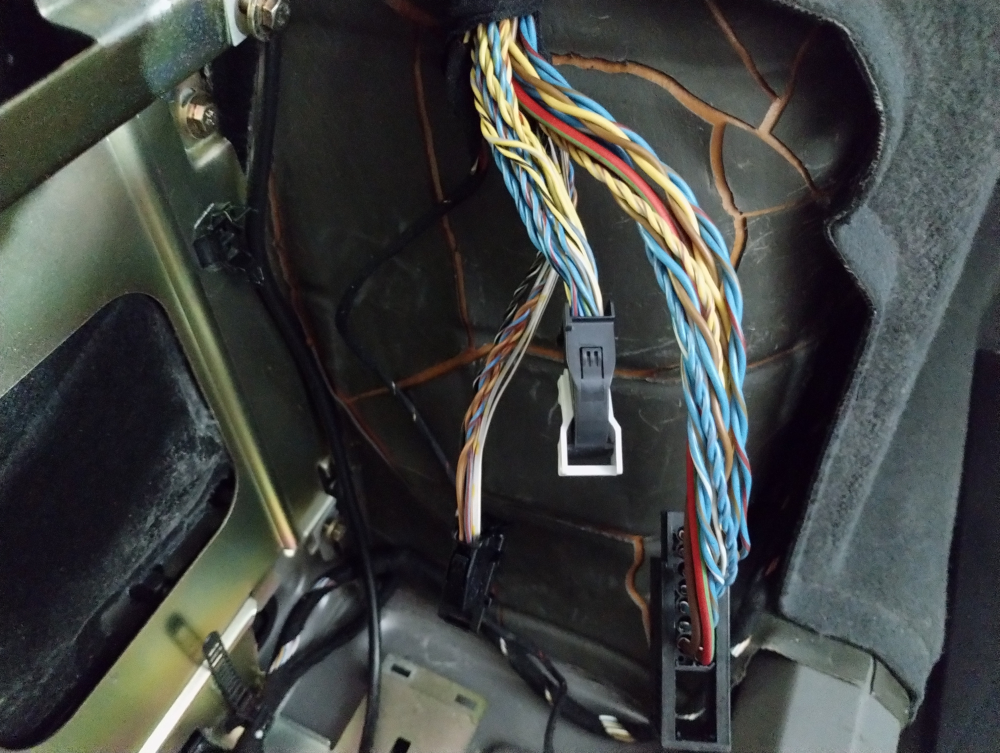
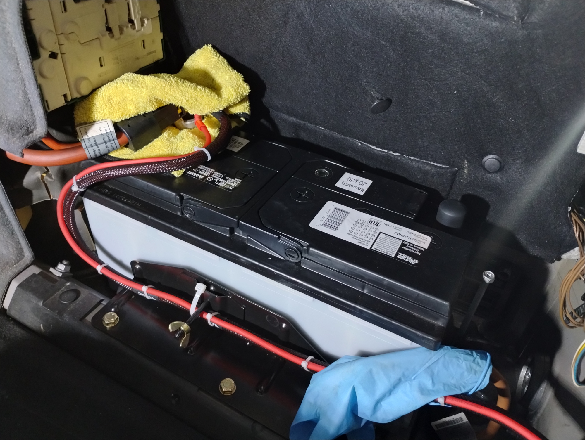
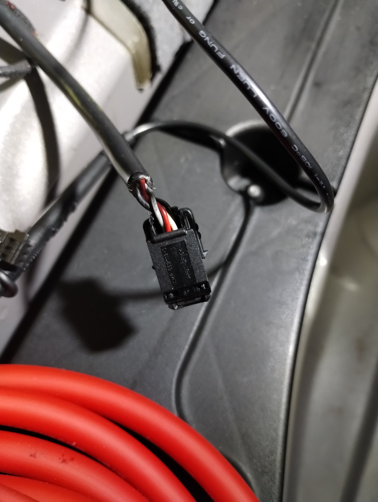
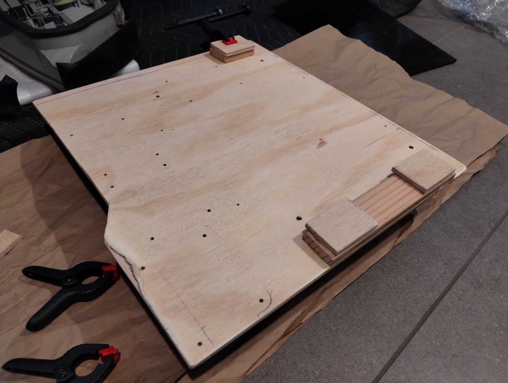
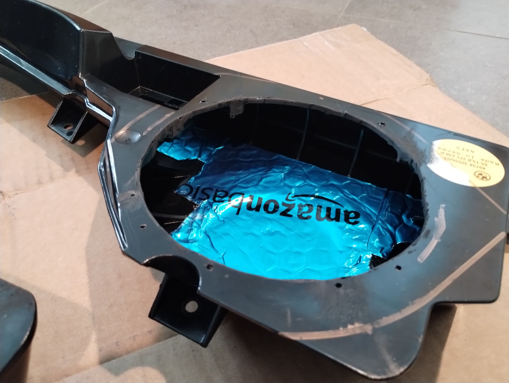
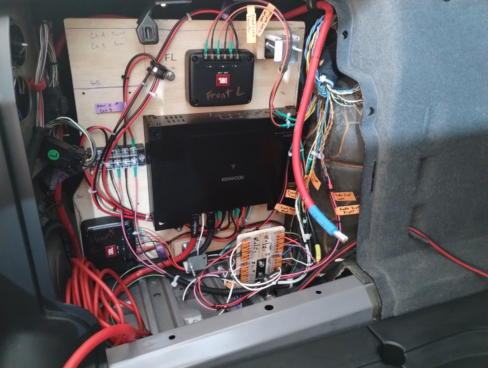
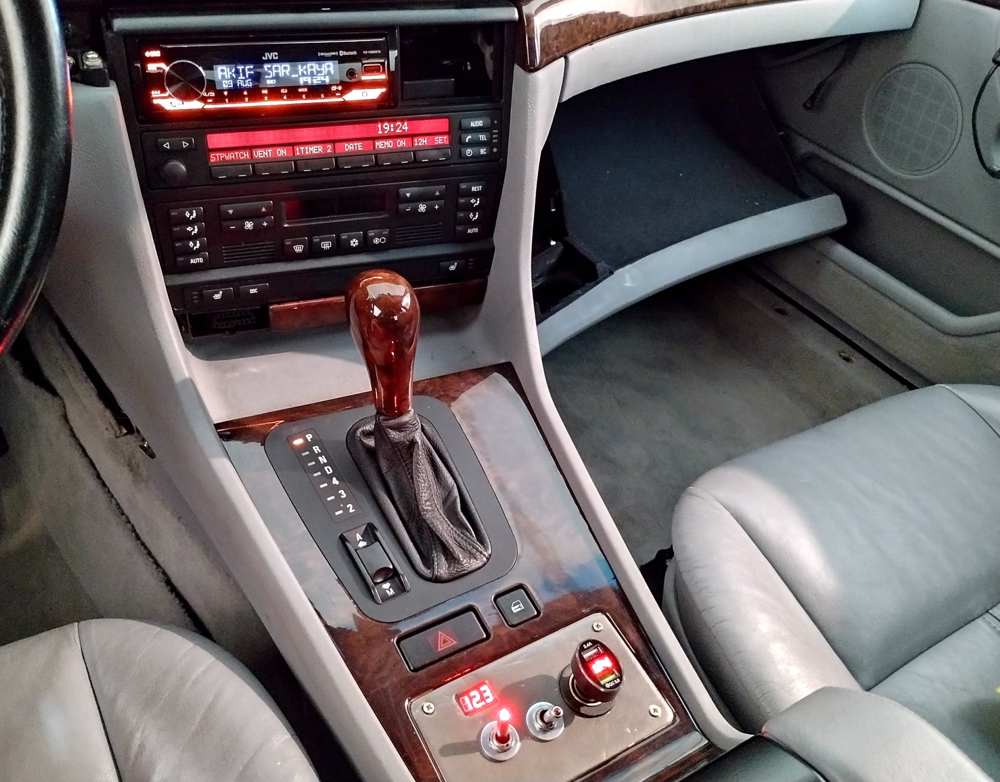

## Intro
The average E38 7 series as of now is older than 20 years. With 2 decades of time, parts wear and break down. This includes the audio hardware. The original speakers in the E38 are paper woofers that have undoubtedly all degraded by now. While it may be simple to buy the original replacements, it's most likely not sensible as inventory diminishes and prices increase. Instead, a better way to tackle this is to moderinize the audio system with bigger and better components tha have modern features like Bluetooth. 

## A Rough How-To With Pictures
Because there are many versions of the E38 with changes across model years and audio options, there is no one guide fits all. Instead, this picture montage will show you one way of doing it. For reference, my car is a 1999 740iL that has the factory DSP package. This means the main radio harness does not have the complete 4 channels of audio wired up. Instead what has to be done is reuse the wires from the CD changer, of which there are conveniently 2 twisted pairs and ground, which is unused.

The OEM setup.

The space with the stock amp and CD changer removed.

The 3 wiring looms that are to be cut and spliced into. 

Routing the battery positive cables to the other side of the trunk where the amp is. The cable is routed under the plastic panel that runs along the back edge of the interior of the trunk.

This is the wire that runs from the front to the CD changer. The red and grey are a twisted pair and the white and black are a twisted pair. These are 20 awg wires and are barely sufficient to carry the high level signal from the new head unit to the amp high level input for the rear speakers.

Making the custom amp mount.

The front speaker box is only large enough for 5.25in speakers. I wanted to maximize the sound system so I put 6.5in speakers. To accomplish this, it is necessary to bore out the opening for the speaker to fit. I applied some sound deadening material to further improve acoustics, or so they say. Whatever, I had a lot sitting around.

The completed amp panel and wires spliced and wired up. I used a Kenwood 5 channel amp as I put a subwoofer. The JBL passive crossovers are for the front doors. The rear doors have a 5.25 in coaxial speaker. There is no need to put components in the rear as they cannot accept 6.5 in speakers and it will be harder to configure with time alignment.

The finished result. The head unit installed in place of the OEM tape deck. The DSP screen has been removed and in its place is the Metra ASWC-1 steering wheel control adapter. Since my car is a 1999, it uses IBUS. Older E38 are said to use MBUS, both of which the ASWC-1 can handle. The cubby in the center console was replaced with a custom made switchboard that shows battery and alternator voltage.
