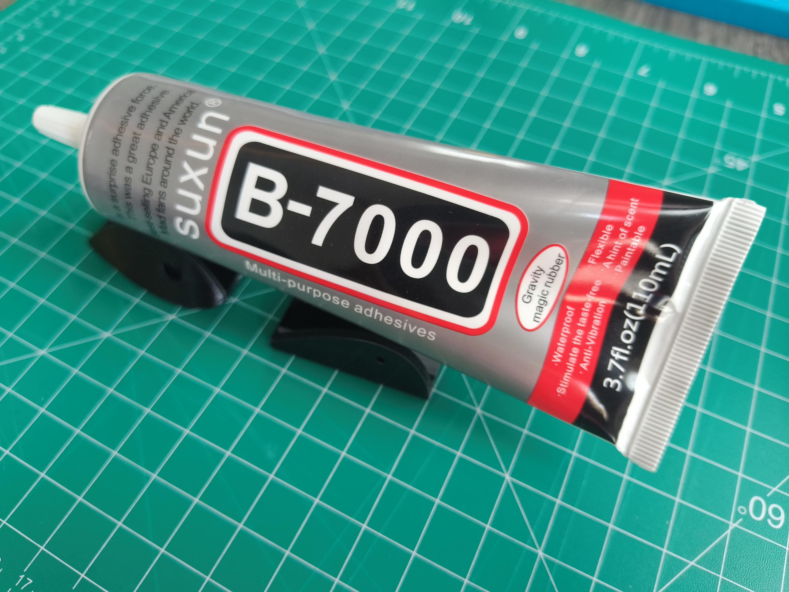
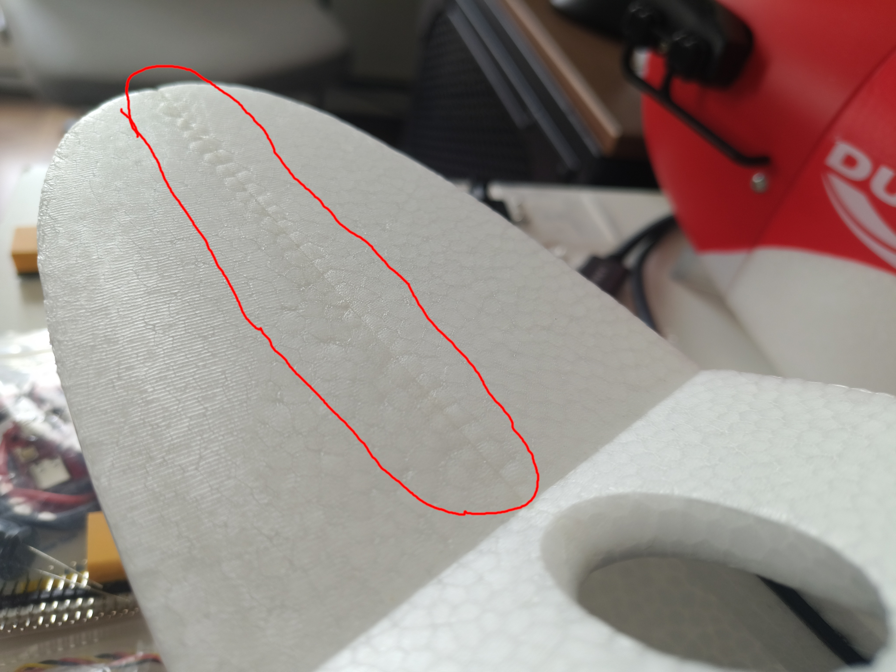

## The Problem

When building RC airplanes for FPV, I went through a long testing process to find the best glue.
I'm very particular about my builds being as robust as possible especially when I'm relying on all the mechanical systems to work reliably as I pilot it FPV.

At first, I scoured the RCGroups forums to see what others were using and it would be your typical mix of cyanoacrylate (CA), two part epoxies, UHU Por, the horrendously expensive FoamTac, E6000, or the Bob Smith FoamCure.
CA is great for small touch up parts or for areas that need a really thin glue to penetrate and make the bond.
I ruled that out because CA will not work well when glueing together large structural pieces like fuselage halves or wings.
I also had bad luck with E6000 so that was a no go.

Thus I started with the BSI FoamCure because it's the cheaptest all in one bottle that gives ample working time.
I applied this to a EPP foam Sonic Model AR Wing Classic.
Initially it seemed like the bond worked great but with some strength I was able to remove the glued pieces.

With FoamCure having failed, I tried two part epoxy next because that also provides ample working time.
I once again applied this to glue the fuselage halves on the AR Wing.
This ended up being strong enough after about 24 hours of cure time, but I was still able to break the bond with a little bit more pulling force on some test pieces of scrap EPP.
Nonetheless, I used epoxy for that build.

## The Solution

It wasn't until a little later I came across the "B-7000" glue in a youtube video and decided to try it because it's suprisingly reasonably priced on Amazon.

I used it initially on a test plane, the EPP based ZOHD Dart 250.
To my pleasant surprise, it worked amazingly well and the bond is perhaps stronger than foam's tensile strength.
This gave me utmost confidence to use it in all my builds

## Important Notes

In my experience thus far using B-7000 for my FPV builds, I have found it will work great to glue almost anything that will be used in the hobby.
I have successfully used to to bond 3D printed parts (PLA, PETG, PETG-CF, TPU) to foam and to each other. 

### EPO Foam

It is important to note that the glue will react slightly with EPO foam.
I did not realize this until I started assembling the XUAV Mini Talon.
Pictured below is the fuselage half where the reaction between the foam and glue can be clearly seen and is outlined in red:

Once the glue has fully cured, the foam becomes ridged and strong.
During the curing process however, the foam does look like it melts and the beads will look warped.

### EPP Foam

EPP foam as found in the popular AtomRC Dolphin and other FPV focused platforms has been the most resilient material for B7000 and is my preferred choice for both EPO and EPP.
The best glue in my opinion for EPP is B7000 because of my aforementioned problems gluing EPP fuselage halves on the AR Wing.